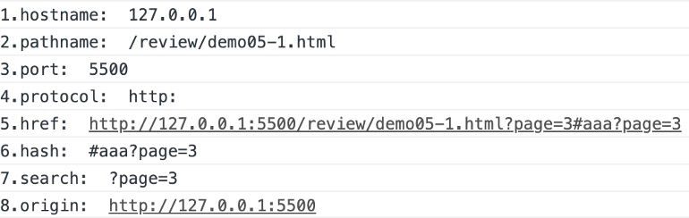
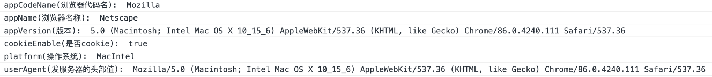
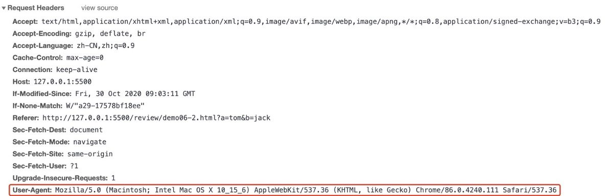
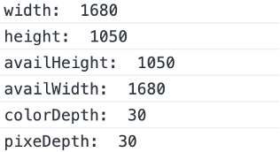

### BOM--Browser Object Model浏览器对象模型

##### 以下都来自window对象 是顶层对象
#### 一.window的内置方法函数
##### 1.定时器 
~~~~
setInterval(function(){},n)   每n毫秒执行一次函数
setTimeout (function(){},n)   n毫秒后执行一次函数
~~~~
##### 2.去除定时器
~~~~
clearInterval()
clearTimeout()
~~~~

##### 计时器到3分钟停
~~~~javascript
var minuteNode = document.getElementsByTagName("input")[0];
var sceondNode = document.getElementsByTagName("input")[1];
var minute=0;
var sceond=0;
var timer = setInterval(function () {
    sceond++;
    if(sceond==60){
        sceond=0;
        minute++;
    }
    minuteNode.value=minute;
    sceondNode.value=sceond;
    if(minute==3){
        clearInterval(timer)
    } 
}, 1000)
~~~~

##### 小说的控制界面
~~~~javascript
var startNoveL = document.getElementsByTagName("button")[0];
var stoppNoveL = document.getElementsByTagName("button")[1];
var acceNoveL = document.getElementsByTagName("button")[2];
var slowNoveL = document.getElementsByTagName("button")[3];
var timerNoveL = 0;
var keyNoveL = true;
var numNoveL = 10;
startNoveL.onclick = function () {//开始阅读
    if (keyNoveL) {
        timerNoveL = setInterval(function () {
            window.scrollBy(0, numNoveL)
        }, 100)
        keyNoveL = false;
    }
}
stoppNoveL.onclick = function () {//停止阅读
    clearInterval(timerNoveL)
    keyNoveL = true;
    numNoveL = 10;
}
acceNoveL.onclick = function () {//加速阅读
    numNoveL++;
}
slowNoveL.onclick = function () {//减速阅读
    numNoveL--;
}
~~~~
##### 3.让滚动条滚动的方法
~~~~
window.scroll(x,y)和window.scrollTo(x,y)两个一样，不累加，滚动到某个点
window.scrollBy(x,y)累加，滚动了x，y的距离
~~~~

#### 二.window的内置属性
##### 1.document对Document的只读引用
~~~~
document                             整个文档
document.getElementById( )             通过元素的Id查找ie9以下的浏览器使用，不区分大小写，Id和元素是一一对应的。
document.getElementsByTagName( )     通过标签名，是个类数组。
document.getElementsByName( )        通过name查找。
document.getElementsByClassName( )    通过classname查找
document.querySelector( )              可以像css一样选择,但是选择的是静态的，不会发生改变的定量var strong=document.querySelector("div > span >strong");
document.querySelectorAll( )
document.createElement( )               创造一个元素节点
var div=document.createElement("div")   创造一个元素节点

document.createTextNode( )              创造文本节点
document.createComent( )               创造注释节点
~~~~
##### 2.history对History的只读引用
~~~~
方法：
1.history.back( )与在浏览器点击后按钮一样，返回到前一个

2.history:forward( )向前进一个页面

3.history.go(number|NRL)加载到具体某个页面（输入一个数，前提是要有历史记录，正数：向前  负数：向后）

4.history.pushState(state, title, url)用于在历史中添加一条记录
var stateObj = { foo: 'bar' };
history.pushState(stateObj, 'page 2', '2.html');

（1）state：一个与添加的记录相关联的状态对象，主要用于popstate事件。该事件触发时，该对象会传入回调函数。也就是说，浏览器会将这个对象序列化以后保留在本地，重新载入这个页面的时候，可以拿到这个对象。如果不需要这个对象，此处可以填null。
（2）title：新页面的标题。但是，现在所有浏览器都忽视这个参数，所以这里可以填空字符串。
（3）url：新的网址，必须与当前页面处在同一个域。浏览器的地址栏将显示这个网址。
注意：1.添加成功后浏览器地址栏立刻显示新的地址，但不会跳转
      2.跳转到新页面后，就可以用history.state属性读出状态对象
      3.插入一个跨域的网址，导致报错

5.history.replaceState()方法用来修改 History 对象的当前记录，参数与pushState()方法一样
  注：改变URL地址的记录下的历史记录
history.pushState({page: 1}, 'title 1', '?page=1')
// URL 显示为 http://example.com/example.html?page=1
history.pushState({page: 2}, 'title 2', '?page=2')
// URL 显示为 http://example.com/example.html?page=2
history.replaceState({page: 3}, 'title 3', '?page=3')
// URL 显示为 http://example.com/example.html?page=3
history.back()
// URL 显示为 http://example.com/example.html?page=1
history.back()
// URL 显示为 http://example.com/example.html
history.go(2)
// URL 显示为 http://example.com/example.html?page=3

6. popstate 事件
每当同一个文档的浏览历史（即history对象）出现变化时，就会触发popstate事件
注意：（1）仅仅调用pushState()方法或replaceState()方法 ，并不会触发该事件，
（2）只有用户点击浏览器倒退按钮和前进按钮，或者使用 JavaScript 调用history.back()、history.forward()、history.go()方法时才会触发。
（3）该事件只针对同一个文档，如果浏览历史的切换，导致加载不同的文档，该事件也不会触发。(用?page=1放在跳转中)
（4）页面第一次加载的时候，浏览器不会触发popstate事件
（5）event.state就是代表传进来的两个方法传进来的第一参数
window.onpopstate = function (event) {
    console.log('location: ' + document.location);
    console.log('state: ' + JSON.stringify(event.state));
};

// 或者
window.addEventListener('popstate', function(event) {
    console.log('location: ' + document.location);
    console.log('state: ' + JSON.stringify(event.state));
});
~~~~

##### 3.innerHeight/innerWidth返回窗口的页面显示的高度/宽度（包括滚动条）
~~~~
ie9以下标准模式用：document.documentElement.clientHeight/Width
ie9以下怪异模式用：docunment.body.clientHeight/Width
通用：docunment.body.style.width/height 利用CSS
~~~~
###### 封装兼容
~~~~javascript
function getViewportOffset() {
    if (window.innerWidth) {
        return {
            width: window.innerWidth,
            height: window.innerHeight
        }
    }
    else {
        if (document.compatMode == "CSS1Compat") {   BackCompat是怪异模式
            return {
                width: document.documentElement.clientWidth,
                height: document.documentElement.clientHeight
            }
        }
        else {
            return {
                width: document.body.clientWidth,
                height: document.body.clientHeight
            }
        }
    }
}
~~~~
######（标准模式html文档最上方有<!DOCTYPE html>,没有就是怪异模式，用document.compatmode的返回值判断是标准模式还是怪异模式CSS1Compat是标准模式，BackCompat是怪异模式）

##### ！4.location用于窗口或框架的Location对象和URL(全球统一资源定位符就是网址)
~~~~
属性：
location.hostname    返回web的主机域名
location.pathname    返回当前页面的路径和文件名
location.port         返回web主机的端口（80或443）
location.protocol     返回所使用的web协议（http://或https://）
location.href         返回完整的URL（http://127.0.0.1:8020或demo02/index.html）
location.hash         返回一个URL的锚点部分
location.search       返回URL的参数字符串吗
~~~~
###### 锚点和参数不能同时出现
­­­­
~~~~
方法：
location.assign(url)  跳转到新文档，可返回 实现超链接
location.replace(url) 用新文档取代当前文档
location.reload( )    刷新文档
~~~~
~~~~
https://www.baidu.com：80/search/img/ddd.html#bottom?name=淘宝&sss=123456
协议：http://    https://
域名：www.baidu.com
资源：search/img/ddd.html
锚点：#bottom
参数：?name=淘宝&sss=123456
~~~~

###### 获取URL地址中的参数值
~~~~javascript
function getRequest() {
    var tempArray = {};
    var strArray = [];
    var temp = window.location.search; 
    if (temp.indexOf("?") != -1) {
        var str = temp.substr(1);
        strArray = str.split("&");
        strArray.forEach(prop => {
            tempArray[prop.split("=")[0]] = prop.split("=")[1];
        });
        return tempArray;
    } else {
        return null;
    }
}
~~~~
##### 5.name设置或返回窗口名

##### 6.navigator对Navigator对象的只读引用
~~~~
属性
navigator.appCodeName  返回浏览器的代码名
navigator.appName       返回浏览器名称
navigator.appVersion     返回浏览器的平台和版本信息
navigator.cookieEnabled   返回指明浏览器中是否启用cookie的布尔值
navigator.platform        返回运行浏览器的操作系统平台
navigator.userAgent       返回由客户机发送服务器的user-agent头部的值
~~~~

­­­­ 
­­­­
~~~~
方法
navigator.javaEnabled( )   指定是否在浏览器中启用java
navigator.taintEnabled( )   规定浏览器是否启用数据污点（data tainting）
~~~~

##### 7.outerHeight/outerWidth返回窗口的外部高度/宽度，包含工具条和滚动条

##### 8.screen对Screen对象的只读引用，表示显示器尺寸
~~~~
screen.width       返回屏幕的总宽度，包括window底部任务栏
screen.height      返回屏幕的总高度，包括window底部任务栏
screen.availWidth  返回屏幕的宽度，不包括window底部任务栏
screen.availHeight  返回屏幕的高度，不包括window底部任务栏
screen.colorDepth  返回屏幕的颜色深度
screen.pixeDepth   返回屏幕的色彩分辨率
~~~~
­­­­
 

##### 9.pageXOffset/YOffset查看滚动条的滚动距离
~~~~
window.pageXOffset横向滚动条距离ie9以下不兼容
window.pageYOffset纵向滚动条距离ie9以下不兼容
~~~~

###### ie9以下的使用方法
~~~~
document.body.scorllLeft                 document.body.scorllTop
document.documentElement.scorllLeft      document.documentElement.scorllTop
这两个互相冲突，但是有其中一个，另一个的值一定是零
~~~~

###### 滚动轮滚动的距离的封装
~~~~javascript
function getScrollOffset() {
    if (window.pageXOffset) {
        return {
            x: window.pageXOffset,
            y: window.pageYOffset
        }
    }
    else {
        return {
            x: document.body.scrollLeft + document.documentElement.scrollLeft,
            y: document.body.scrollTop + document.documentElement.scrollTop
        }
    }
}
