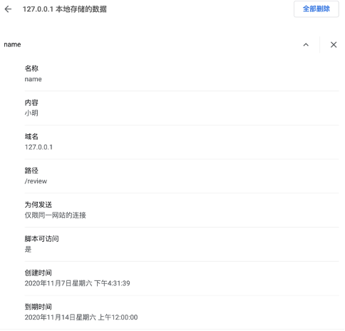

### Cookie和Web Storage
~~~~
客户端数据存储
~~~~

#### Cookie
~~~~
优点:
    1.可以和服务器端交互
    2.浏览器自动管理不同站点的数据并发送到服务器端
缺点:
    1安全性不好
    2.数据存储量不大 4KB
    3.可用性受限
    4.明文存储
~~~~

##### 写Cookie
~~~~
document.cookie操作
第一步：设置指定的格式的字符串。cookie名=cookie值（多个用逗号隔开）；expires=失效时间的GMT格式的字符串
第二步：赋值给document对象的cookie属性
第三步：如果有多个重复上述两步
第四步：如果未指定expires，则是浏览器关闭cookie就失效了
var today = new Date();
var expireDay = new Date(today.getFullYear(), today.getMonth(), today.getDate() + 7);
var strUsername = "username=" + lodeText.value + ";expires=" + expireDay.toGMTString();
document.cookie = strUsername;
var strPassword = "password=" + lodePassword.value + ";expires=" + expireDay.toGMTString();
document.cookie = strPassword;
~~~~
­­­­

##### 读Cookie
~~~~
通过document.cookie整体读取，需要进行拆分
拆分步骤：
第一步：按照“; ”拆分为多个键值对(是分号加空格)
第二步：按照“=”拆分为键和值
var cookieString=document.cookie;
var cookieArray=cookieString.split("; ");
for(var i=0;i<cookieArray.length;i++){
    var cookieArray2=cookieArray[i].split("=");
}
利用
slice(a,b) 从第a位截取到第b位
indexOf(‘a’,3)搜索字符串“a”从第3位往后出现位置的索引，检索不到返回-1
可以精准搜索想要的cookie值
考虑到安全性，一般会对写入的value值进行编码encodeURIComponent（value）
读取时对value进行解码decodeURIComponent（value）
~~~~

#### Web Storage  
~~~~
HTML5新增，分为localStorage和sessionStorage
~~~~
##### 区别：
~~~~
1.localStorage   数据永久有效
2.sessionStorage浏览器关闭后数据失效
~~~~
~~~~
优点：
    1.操作简单
    2.不会自动发到服务器端
    3.存储空间大5M-10M
缺点：
    1.安全性不好
    2.永不过期
    3.不区分站点
    4.明文存储
~~~~

##### 写
~~~~
localStorage.变量名=值；
~~~~

##### 读
~~~~
localStorage 读取所有
var value=localStorage.变量名;
~~~~

##### 常用的API
~~~~
length存储的键值对数目
setItem（key，value）写入数据
getItem（key）读数据
removeIItem（key）删除
clear（）清除所有
key（index）获取index位置的key
~~~~

##### 事件机制
~~~~
window.addEventListener(“storage”,doReaction ,flag);
1.storage表示对（包括session和local）进行监听
2.doReaction:自定义函数，事件发生是的回调，会接受一个StorageEvent类型的参数，包括storageArea，key，oldValue，newValue，url
3.flag表示触发时机（false目标和冒泡是触发，true为捕获时触发），一般多使用false
