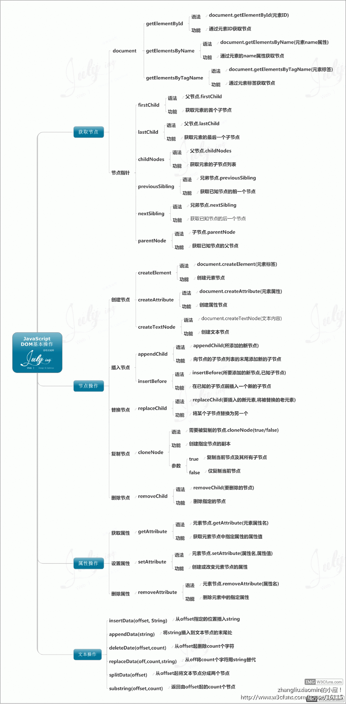

### DOM--Document Object Model文档对象模型

#### DOM是编程接口，可以操作html和xml不能直接操作css
#### xml被json取代了
###### 如下

##### 交换颜色
~~~~javascript
var div = document.getElementsByTagName("div")[0];
div.style.width = "100px";
div.style.height = "100px";
div.style.backgroundColor = "red";
var count = 0;
div.onclick = function () {
    count++;
    if (count % 2 == 1) {
        this.style.backgroundColor = "blue";
    }
    else {
        this.style.backgroundColor = "red";
    }
}
~~~~

##### 选项卡
~~~~javascript
var btn = document.getElementsByTagName("button");
var div = document.getElementsByClassName("content");
for (var i = 0; i < btn.length; i++) {
    (function (n) {
        btn[i].onclick = function () {
            for (var j = 0; j < btn.length; j++) {
                btn[j].className = "";
                div[j].style.display = "none";
            }
            this.className = "active";
            div[n].style.display = "block";
        }
    }(i))
}
~~~~
#### 查BOM获取元素
~~~~
1.document 整个文档

2.document.getElementById( ) 通过元素的Id查找ie9以下的浏览器使用，不区分大小写，Id和元素是一一对应的。

3.document.getElementsByTagName( ) 通过标签名，是个类数组。

4.document.getElementsByName( ) 通过name查找。

5.document.getElementsByClassName( ) 通过classname查找

6.document.querySelector( ) 可以像css一样选择，但是选择的是静态的，不会发生改变的定量
var strong=document.querySelector("div > span >strong");

7. document.querySelectorAll( )
~~~~
#### 节点类型(node.nodeType)
~~~~
元素节点             1
属性节点             2
文本节点             3
注释节点             8
document            9
DocunmentFragment  11
~~~~
#### 节点的属性
~~~~
node.nodeName节点的name只读
node.nodeValue 只有文本和注释有这个属性
node.nodeType节点属性，返回数字
node.attributes 返回一个元素的属性数组
node.hasChildNodes();
~~~~
#### 遍历节点数
~~~~
elem.parentNode 查找父级标签，最顶端是document

elem.childNodes查找子节点数，是个类数组d

elem.firstChild第一个子节点

elem.lastChild最后一个子节点

elem.nextSibling下一个节点

elem.previousSibling上一个节点
~~~~
#### 遍历元素节点
~~~~
elem.parentElement元素父节点

elem.children元素子节点 ie9下只有这个可以实现，剩下五个都不能

elem.firstElementChild元素第一个元素子节点

elem.lastElementChild元素最后一个元素子节点

elem.nextElementSibling元素下一个元素子节点

elem.previousElementSibling元素上一个元素子节点
~~~~
#### 遍历元素节点树（自己封装不完整）
~~~~javascript
function retElementChildAll(node) {
    var obj = {
        length: 0,
        push: Array.prototype.push,
        splice: Array.prototype.splice
    };
    var chin = node.children;
    var len = chin.length;
    for (var i = 0; i < len; i++) {
        if (chin[i].children.length == 0) {
            obj.push(chin[i])
        }
        else {
            obj.push(chin[i]);
            retElementChildAll(chin[i]);想办法在重新建立obj
        }
    }
    return obj;
}
~~~~
#### 封装myChildren功能解决不封浏览器的兼容性问题
~~~~javascript
Element.prototype.myChildren = function () {
    var obj = {
        length: 0,
        push: Array.prototype.push,
        splice: Array.prototype.splice
    }
    var chin = this.childNodes;
    var len = chin.length;
    for (var i = 0; i < len; i++) {
        if (chin[i].nodeType == 1) {
            obj.push(chin[i]);
        }
    }
    return obj;
}
~~~~
#### 封装hasChildren()方法 不用children属性
~~~~javascript
Element.prototype.hasChildren = function () {
    var arr = this.myChildren();调用上面的方法
    if (arr.length == 0) {
        return false;
    }
    else {
        return true;
    }
}
~~~~
#### 封装函数，返回元素e的第n个兄弟元素节点，n为正，返回下面的兄弟节点数，n为负返回上面的兄弟节点数，n为0返回自己，考虑兼容问题
~~~~javascript
function retSibling(e, n) {
    if (n > 0) {
        while (e && n) {
            if (e.nextElementSibling) {
                e = e.nextElementSibling;
            }
            else {
                for (e = e.nextSibling; e && e.nodeType != 1; e = e.nextSibling);//
            }
            n--;
        }
        return e;
    }
    else {
        while (e && n) {
            if (e.previousElementSibling) {
                e = e.previousElementSibling;
            }
            else {
                for (e = e.previousSibling; e && e.nodeType != 1; e = e.previousSibling);//
            }
            n++;
        }
        return e;
    }
}
~~~~
#### DOM结构树--继承关系
~~~~
Node
  1.Docunent----HTMLDocument----document
  2.CharacterDate
1.Text文本
2.Comment注释
  3.Element----HTMLElement
  1.HTMLHeadElement
   2.HTMLBodyElement
   3.HTMLTitleElement
   4.HTMLParagraphElement
   5.HTMLInputElement
   6.HTMLTableElement
  …etc
  4.Attr
~~~~
~~~~
1.Docunment的__proto__上有getElementById方法
2.HTMLDocument的__proto__上有getElementsByName方法
3.Docunment的__proto__上和Element的__proto__上有getElementsByTagName方法
4. getElementsByTagName(‘*’)[0]是选择所有标签
5.常用的属性：document.head----<head>
            document.body----<body>
            document.documentElement----<html>
~~~~
#### 增DOM
~~~~
document.createElement( ) 创造一个元素节点
var div=document.createElement("div")//创造一个元素节点
document.createTextNode( ) 创造文本节点
document.createComent( ) 创造注释节点
~~~~
#### 插
~~~~
element.appendChild( )可以理解成push，剪切插入
document.body.appendChild(div);//将节点放到页面
div.insertBefore(a,b)在父级div上调用，把a查到div的子元素b前
div.insertBefore(strong,p);//在div标签里把strong标签放在p标签前面
~~~~
#### 删
~~~~
parent.removeChild(a)父级调用删除子元素a可以又返回值，返回被删除的元素
var moveElement = div.removeChlid(p)在div标签里删除p标签，返回值是p标签
child.remove( )子元素自己彻底删除
p.remove//p标签删除
~~~~
#### 替换
~~~~
parent.replaceChild(new,orgin)
~~~~
#### Element节点的一些属性
~~~~
div.innerHTML    HTML内容，可读可写
div.innerText      文本内容可读可写，老版火狐不兼容 老版火狐用textContent
~~~~
#### 节点上的一些方法
~~~~
div.setAttribute(id,only)设置行间属性id叫做only
div.getAttribute(only)取
可以利用这个做点击量打点统计
div.classname可以直接用
~~~~
#### 封装一个insertAfter()
~~~~javascript
Element.prototype.insertAfter=function(targerNode,afterNode){
  var allElement=this.children;
  var len=allElement.length;
  for(var i=0;i<len;i++){
      if(i!=length-1){
          if(allElement[i]==afterNode){
              this.insertBefore(allElement[i+1],targerNode)
          }
      }
      else{
          this.appendChild(targerNode)
      }
  }
  return this;
}
~~~~
~~~~javascript
var beforeNode=afterNode.nextElementSibling;
if(beforeNode==null){
        this.appendChild(targerNode);
    }
    else{
        this.insertBefore(targerNode,beforeNode);
    }
return this
}
~~~~
##### 将目标标签内的标签顺序逆序
~~~~javascript
Element.prototype.reverseElement=function(){
    var chil=this.children;
    var n=chil.length-1;
        while(n){
            this.appendChild(chil[n]);
            n--;
        }
        this.appendChild(chil[0]);
}
var div=document.getElementsByTagName("div")[0];
~~~~
#### 查看元素信息
~~~~
elem.getBoundingClientRect();
兼容性很好，但是返回的结果不是实时的，查看dom元素的信息包括宽高位置等

elem.offsetWidth
elem.offsetHeight
查看元素的尺寸，是可视区的尺寸不是真实宽高

elem.offsetLeft();
elem.offsetTop();
查看元素位置，但是如果父级有定位，那就是相对于父级的位置

elem.scrollLeft
elem.scrollTop
返回当前元素的左（上）边缘距离窗口左（上）边缘的距离

elem.scrollHeight
elem.scrollWidth
返回元素整个的宽度/高度包括带滚动条的隐藏部分

elem.clientHeight
elem.clientWidth
在页面中返回元素的可视高度/宽度（不包括边框，边距，滚动条）

elem.offsetParent();
返回最近有定位的父级

elem.getElementPosition();
求元素相对于父级的定位

脚本化css间接操作css
div.style可读可写
返回CSSStyleDeclaration的一个类数组
div.style.width=”200px”;后面写的内容是字符串
float 用div.style.cssFloat表示

window.getComputedStyle(div,null) 只读不可写，返回的都是绝对值，比如绝对高度，rgb颜色,ie9以下不兼容
返回一切div的显示样式
null可以换成after和before就是修改伪类的样式
window.getComputedStyle(div,null).width
~~~~
###### ie9以下
~~~~
div.currentStyle
~~~~
###### ie独有
###### 封装查询dom属性的css样式的方法
~~~~javascript
function getCSSStyle(elem, prop) {
    if (window.getComputedStyle) {
        return window.getComputedStyle(elem, null)[prop];null改成before或者after获取伪元素
    }
    else {
        return elem.currentStyle[prop];
    }
}
~~~~
­­­­