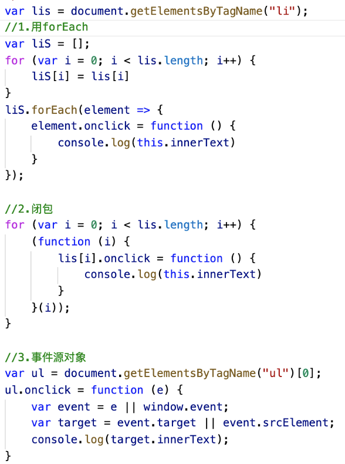

### 事件
#### 交互动作
###### HTML：
~~~~html

~~~~
###### JS：
~~~~javascript
var div = document.getElementsByTagName(“div”)[0]
   div.onclick = function () {
        …
   }
~~~~
#### 1.绑定事件
~~~~
（1）div.onxxx=function(){}
兼容性很好等于写在html的行间上，但是事件只能绑定一个函数
也就是想当于给div.onxxx赋值。
可以写在行间onclick:”console.log(“…”)”

（2）div.addEventListener(type，fn，boolean)
也可以function fn(){}再把fn放到上面这样写是只能绑定一个事件fn
type:绑定的事件类型比如“click”用引号括起来填入
fn:执行的事件函数
boolean:填写false和true
ie9以下不兼容，可以为一个事件绑定多个处理的函数，并且绑定顺序去执行！！
但是同一个函数绑定多次执行一次。

（3）div.attachEvent(“on”+type，fn)
Ie独有，一个事件绑定多个函数
~~~~
小练习
~~~~
<ul>
<li>1</li>
<li>2</li>
<li>3</li>
</ul>点击数字在控制台上答应相应的数字
~~~~

­­­­

#### 2事件处理程序的运行问题this
~~~~
（1）div.onxxx=function(){}
this指向dom元素div

（2）div.addEventListener(type，fn，boolean)
this指向dom元素div

（3）div.attachEvent(“on”+type，fn)
this指向window
让也指向div
div.attachEvent(“on”+type，function(){
handle.call(div);
})
function handle(){
  把事件函数写在这里！！！
}
~~~~
~~~~javascript
//给一个dom对象添加某事件类型的某处理函数
function addEvent(elem, type, fn) {
    if (elem.addEventListener) {
        elem.addEventListener(type, fn, false);
    }
    else if (elem.attachEvent) {
        elem.attachEvent("on" + type, function () {
            fn.call(elem);
        })
    }
    else {
        elem["on" + type] = fn;
    }
}
//更好的事件绑定的过程
~~~~
#### 3.解除事件处理程序
~~~~
div.onxxx=null;写在函数体里面也可以
div.removeEventListener(type,fn,boolean);与绑定相一致
div.detachEvent(“on”+type,fn);

若绑定匿名函数则无法解除
div.addEventListener(type,text,boolean);
function text (){}
div.removeEventListener(type,text,boolean);
~~~~

#### 4.事件处理模型—事件冒泡，捕获
~~~~
div.addEventListener(type，fn，boolean)

（1）冒泡false
【A嵌套B，B嵌套C】事件执行会往父级去漏，比如点击了C会执行CBA，点击B执行BA，点击A执行A。
结构上（非视觉上）存在父子关系的元素，事件触发的顺序点击在子元素，会一级一级向父级去发生执行，先执行子元素本身

（2）捕获true 只有谷歌浏览器实现
刚好和冒泡相反，捕获最外父级向子级，【A嵌套B，B嵌套C】点击C执行ABC，点击B执行AB，点击A执行A，点击的地方叫做常规执行，其他地方是冒泡和捕获
!!!div.setCapture();会把界面上所有的事件都捕获到div自身上，当做自己发生的
对应的是div.releaseCature();释放只有ie能用
（3）触发顺序先捕获后冒泡
同一个对象的同一个时间处理类型，上面绑定了两个事件处理函数，发生规则是先捕获后冒泡
div.addEventListener(type，fn，false)1
div.addEventListener(type，fn，true)2
先执行2后执行1，
但是正常的常规顺序按执行先后顺序，谁先绑定谁先执行

（4）focus blur change submit reset select没冒泡和捕获
~~~~

#### 5.取消冒泡和阻止默认事件
~~~~
取消冒泡
！！！不绑定事件处理函数依旧有冒泡天生自然的
 1.event.stopPropagation();ie9以下不可以 
 2.event.canceBubble=true;也可以实现
~~~~
~~~~javascript
div.onclick=function(e){
  e.stopPropagation(); 
  e.canceBubble=true;
  …
}
~~~~
~~~~
e会被系统自动存储事件对象的信息，在这些里面，有一个方法可以取消冒泡
~~~~
~~~~javascript
//封装取消冒泡函数
function stopBubble(event){
    if(event.stopPropagation){
        event.stopPropagation();
    }
    else{
        event.canceBubble=true;
    }
}
~~~~
~~~~
阻止默认事件
默认事件包括表单提交(刷新页面)，a标签跳转，左键菜单等
document.oncontextmenu=function(){}右键出菜单默认事件
（1）return false
document.oncontextmenu=function(){
   console.log(“a”)
returu false;//阻止了出菜单等，但不适合第二种绑定事件
}

（2）event.preventDefault();ie9以下不兼容
document.oncontextmenu=function(e){
   console.log(“a”)
   e. preventDefault();
}

（3）event.returnValue=false 兼容ie
document.oncontextmenu=function(){
    console.log(“a”)
   e. returnValue=false
}
~~~~
~~~~javascript
//阻止默认事件封装
function cancelHandler(event){
    if(event.preventDefault){
        event.preventDefault();
    }
    else{
        event.returnValue=false;
    }
}
~~~~

##### a标签行间阻止默认事件 
~~~~html

~~~~

#### 6.事件对象
~~~~
（1）event  ||  window.event
div.onclick=function(e){}-------e就是事件对象，但是ie浏览器下e会失效，所以用window.event   于是就有兼容的操作
div.onclick=function(e){
   var event=e || window.event;
   console.log(event)
}
~~~~
~~~~
（2）事件源对象
 -1-event.target 火狐有这个
 -2-event.srcElement  ie有这个
    -3-谷歌都有 
A元素里嵌套B元素，点击B冒泡执行BA，A事件的源事件就是B
~~~~
#### 7.事件委托！！！
~~~~
<ul>
<li>1</li>
<li>2</li>
<li>3</li>
<li>4</li>
</ul>
点到什么打印相应的文本
~~~~
~~~~javascript
var ul=document.getElementsByTagName("ul")[0];
ul.onclick=function(e){
   var event=e||window.event;
   var targer=event.target||event.srcElement;
   console.log(targer.innerText)
}
~~~~
~~~~
利用冒泡，和对事件源对象进行处理
优点：1.不需要循环所有元素一个个绑定的事件
      2.灵活，当有新的子元素加入不需要重新绑定事件
~~~~
#### 8.事件分类
~~~~
（1）鼠标事件
click 当鼠标点击放开=mousedown+mouseup，触发顺序mousedown>mouseup>click
-1-mousedown 鼠标摁住
-2-mouseup 鼠标松开
-3-mousemove当鼠标光标放在界面上面可以移动时
-4-contextmenu右键产生菜单取消
-5-mouseover 类似与hover移入区域
-6-mouseout移出区域
-7-mouseenter类似与hover移入区域h5
-8-mouseleave移出区域h5
~~~~
~~~~
（2）用e的属性button来区分鼠标按键0/1/2
 只有mouseup和mousedown可以监听
doncument.onmouseup=function(e){
  1.e.button==0左键
  2.e.button==1滚轮
  3.e.button==2右键
}
click只能监听左不能监听右
~~~~
~~~~javascript
//用时间差区别拖拽和点击，防止拖拽影响点击
//以下是点击打印click在控制台，拖拽没有
var firstTime = 0;
var lastTime = 0;
var key = false;
addEvent(div, "mousedown", mouseDown);
function mouseDown() {
    firstTime = new Date().getTime();
}
addEvent(div, "mouseup", mouseUp);
function mouseUp() {
    lastTime = new Date().getTime();
    if (lastTime - firstTime < 300) {
        key = true;
    }
}
addEvent(div, "click", clickk);
function clickk() {
    if (key) {
        console.log("click")
        key = false;
    }
}
~~~~
#### 9.键盘类事件
~~~~
(移动端鼠标事件就不能用了，移动端用touch事件touchstart/touchmove/touchend)

-1-keydown:按下不抬起可以连续触发，能监听所有按键，检测字符类不准，事件对象e的which有值就是所有键的一个编码，但不能区分字母大小写，以及多个按键一起按的效果
-2-keyup:抬起与keydown对应
-3-keypress:与kedown一样也是按下，不能监听所有的键，触发顺序keydown后，事件对象e的charCode有值,是asc码，能监听asc码里的有的东西，（可以区别字母大小写）没在asc里面的不能触发事件
事件触发顺序：keydown>keypress>keyup
keypress的e里的charCode属性可以得到的asc编码，通过String.fromCharCode()转化成字符
10.文本类操作事件聚焦文本input，用于搜索栏
-1-input但凡里面有内容有变化都会触发事件（input标签里的value）
-2-focus 聚焦以后怎么怎么样
-3-blur失去焦点怎么这么样（用于搜索栏里面的导航文字）
~~~~
~~~~javascript
var input = document.getElementsByTagName("input")[0]
addEvent(input, "focus", fousE);
function fousE(e) {
    var event = e || window.event;
    if (this.value == "请输入") {
        this.value = "";
        this.color = "#424242"
    }
    stopBubble(event);
    cancelHandler(event);
}
addEvent(input, "blur", bluR);
function bluR(e) {
    var event=e||window.event;
    if(this.value==""){
        this.value="请输入";
        this.color="#999";
    }
    stopBubble(event);
    cancelHandler(event);
}
~~~~
#### 四，change改变后失去焦点就触发了，对比聚焦和失去焦点之间value
##### 11.window事件
~~~~
窗体类操作在window上的事件
-1-scrll：滚动条一滚动事件触发
-2-load：尽量不用，写在标签上面，没有意义，效率低，用处：判断整个页面下载完了，多用DOMContentLoaded
~~~~
~~~~javascript
//小说界面的自动阅读，停止自动阅读，加速阅读，减速阅读
var startNoveL = document.getElementsByTagName("button")[0];
var stoppNoveL = document.getElementsByTagName("button")[1];
var acceNoveL = document.getElementsByTagName("button")[2];
var slowNoveL = document.getElementsByTagName("button")[3];
var timerNoveL = 0;
var keyNoveL = true;
var numNoveL = 10;
startNoveL.onclick = function () {开始阅读
    if (keyNoveL) {
        timerNoveL = setInterval(function () {
            window.scrollBy(0, numNoveL)
        }, 100)
        keyNoveL = false;
    }
}
stoppNoveL.onclick = function () {停止阅读
    clearInterval(timerNoveL)
    keyNoveL = true;
    numNoveL = 10;
}
acceNoveL.onclick = function () {加速阅读
    numNoveL++;
}
slowNoveL.onclick = function () {减速阅读
    numNoveL--;
}
~~~~
~~~~javascript
//拖拽和点击区分，利用时间差
var firstTime = 0;
var lastTime = 0;
var key = false;
addEvent(div, "mousedown", mouseDown);
function mouseDown() {
    firstTime = new Date().getTime();
}
addEvent(div, "mouseup", mouseUp);
function mouseUp() {
    lastTime = new Date().getTime();
    if (lastTime - firstTime < 300) {
        key = true;
    }
}
addEvent(div, "click", clickk);
function clickk() {
    if (key) {
        console.log("click")
        key = false;
    }
}
~~~~