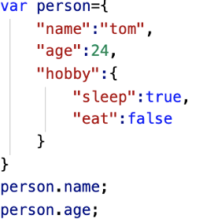

### JSON

#### 一.JavaScript Object Notation  JavaScript对象表示法
~~~~
创建JSON文件xxx.JSON
~~~~
#### 二.JSON是一种传输数据的格式（以对象为样板，本质上就是对象，但用途有区别，对象就是本地用的，JSON是用来传输的）

#### 三.里面只有属性，没有方法（也可以加，但不建议）

#### 四.格式：JSON里的属性名对象名必须双引号(不能是单引号)
­­­­
 

#### 五.JSON数组
~~~~
[
  {JSON内容},
  {JSON内容},
  {JSON对象},
  {JSON对象}
]
~~~~

#### 六.字符串和JSON的转换
~~~~
JSON.parse();       string转化成JSON对象（注意字符串不要有空格换行）
JSON.stringify();     JSON对象转化成string 
~~~~
 
#### 七.利用AJAX获取字符串，转化为JSON格式
~~~~
AJAX.get(‘http://……’,function(data){
   var obj=JSON.parse(data);
   然后操作obj
});
~~~~
