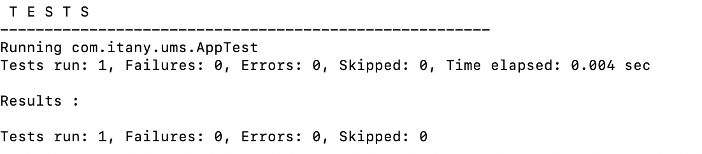

### Maven
~~~~
用于软件项目管理和构建工具，可以帮助我们创建管理项目
基于项目对象模型POM（Project Object Model）的概念，帮助开发者构造一个完整的生命周期
注：POM是Maven对一个项目的描述，是Maven的核心，一个POM其实就是一个XML文件
~~~~
~~~~
1.拆分成多个子项目，各个子项目存在依赖关系
2.通过仓库jar包管理，项目jar包都存在Maven仓库中
3.解决jar包依赖关系
4.自动下载jar包
~~~~
~~~~
构建过程：编译主代码->编译测试代码->执行单元测试->生成测试报告->打包->部署
~~~~
~~~~
Maven术语：
中央仓库，是一个网络仓库repo.maven.apache.org/maven2/
本地仓库，是从中央仓库下载的存到本机的地址/var/root/.m2/repository
镜像仓库，国内的中央仓库maven.aliyun.com/nexus/content/groups/public
私服，局域网内部搭建的maven服务器
~~~~

#### 创建maven项目
~~~~
在终端的maven-project文件下 mvn archetype:generate  表示用模板创建项目
mvn archetype:generate -DarchetypeCatalog=internal
~~~~
##### 这是项目ID

­­­­

##### 这是模块ID

­­­­
 
#### 一.创建JAVA项目archetype:(maven-archetype-queckstart)使用模板创建JAVA项目
~~~~
java约定分目录结构
|-项目名称
  |-pom.xml
|-src(项目代码)
  |-main(主代码)
      |-java(用于存放源代码相当于src)
          |-com
              |-itany
                  |-ums
      |-resources(可以手动创建，用于存放配置文件)
  |-test(测试代码)
      |-...
~~~~
#### 二.创建Web项目mvn archetype:generate -DarchetypeCatalog=internal
~~~~
(archetypes:maven-archetype-webapp) 使用模板创建web项目
web项目的约定项目结构
|-项目名称
  |-pom.xml
|-src(项目代码)
  |-main(主代码)
      |-java(自己创建)
          |-com
              |-itany
                  |-ums
      |-resources(用于存放配置文件)
      |-webapp（webRoot）
          |-WEB-INF
              |-web.xml              
          |-index.jsp
  |-test(测试代码)
      |-...
    
~~~~

#### 三.Maven的常用命令
~~~~
命令	        作用	        效果
archetype	创建maven项目	生成项目骨架
clean	        清理	        删除target目录
compile	        编译	        将main中的源代码编译成字节码，自动创建了target文件夹
test	        执行测试	        执行测试类（使用JUnit），并生成测试报告
package	        打包	        将java项目打包成jar文件，将web项目打包成war文件，访问target中
install	        安装	        目的是分享jar分享，将jar包安装到本地仓库，供其他项目使用
deploy	        发布/安装	将项目的jar包放到中央仓库（需要账户和密码）
site	        生成站点	        生成一个关于项目介绍的网站（使用说明手册）
~~~~
~~~~
所有的命令都是跟在mvn的后面如 mvn archetype，都必须在项目根目录下执行
clean 删除target目录
compile 先将终端路径切换但项目目录中 然后执行命令mvn compile
~~~~
###### test 结果
­­­­ 
~~~~
测试报告：Apptest.txt
install 安装到本地仓库to /var/root/.m2/repository/com/itany/ums/test/1.0-SNAPSHOT/test-1.0-SNAPSHOT.jar
~~~~

#### 四.war 包部署到本地tomcat上
~~~~
1.将war文件夹放入tomcat文件夹下的webapps文件夹内，
2.再讲bin文件下的startup.sh拖入终端
~~~~

#### 五.使用tomcat插件
~~~~
mvn tomcat:run