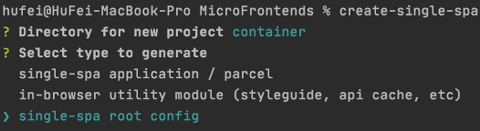
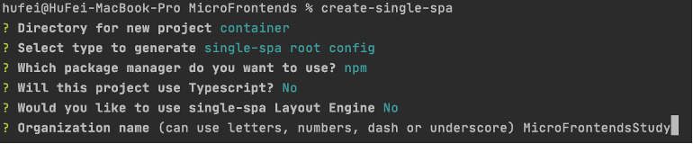
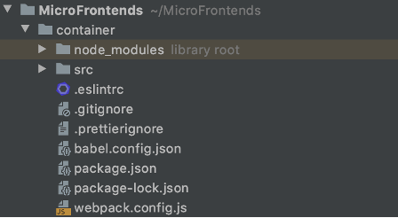
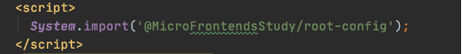
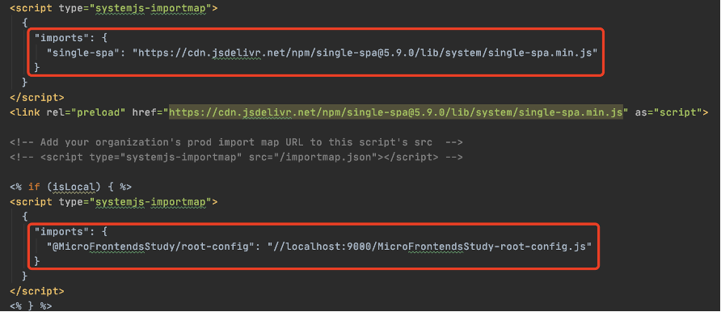

### 微前端Micro Frontends
#### 一.概念
~~~~
1.主要解决¬大型项目、老项目的更新迭代，
2.本身不是一门技术，是与多个可以独立发布功能的团队一起构建现代化的web应用程序的技术、策略和方法
3.从微服务借鉴过来，把整个项目分解成一个个小项目、完成以后又能把小项目组成一个完整的大项目，每个小项目可以用不同的框架
~~~~
#### 二.适用的项目
~~~~
1.拆分巨型应用，使应用变得更加可维护
2.兼容历史应用，实现增量开发
~~~~
#### 三.微前端架构的特点
~~~~
1.独立部署
2.增量迁移
3.团队自治
4.松耦合代码
~~~~
#### 四.微前端架构方案
~~~~
1.自由组织模式（自己玩，不借助框架，需要把代码去约定好用SystemJs）
2.基座模式（搭建基座，配合配置中心去管理所有子应用Single-spa）最流行
3.去中心模式（脱离基座模式，相同技术栈的每个基座都可以互相分享资源，webpack5）
~~~~
#### 五.SystemJs模块化解决方案（对插件的要求很高，非常敏感）

#### 六.Single-Spa微前端框架npm install create-single-spa@2.0.3 -g
##### 1.三种类型的微前端应用
~~~~
（1）single-spa-application/parcel 微前端架构的微应用，可以使用vue、react、angular、jquery甚至原生js等框架
（2）single-spa root config 创建微前端容器应用
（3）utility modules 公共模块应用，非渲染组件，用于跨应用共享JavaScript逻辑的微应用
~~~~
##### 2.创建容器create-single-spa
 ­­­­
###### 注意：创建时先创建容器，也就是上述的第二种

###### （一）.五个创建初始化的问题
~~~~
（1）项目的名字
（2）项目的应用
（3）使用说明工具
（4）用不用TypeScript
（5）用不用single-spa的引擎
（6）给团队取一个名字
~~~~
  ­­­­
  ­­­­
 

###### （二）.xxx-root-config.js文件
~~~~javascript
//注册应用
registerApplication({
  name: "@single-spa/welcome", //引入的微前端应用 @组织名/应用名称
  app: () =>//返回一个Promise，通过systemjs引入
    System.import(
      "https://unpkg.com/single-spa-welcome/dist/single-spa-welcome.js"//引入的地址，可以是本地也可以是远端
    ),
  activeWhen: ["/"],//匹配的路由，激活应用
});

start({
  urlRerouteOnly: true, //是否可以通过history.pushState()和history.replaceState()更改触发single-spa路，true是不允许、false是允许
});
~~~~
###### （三）.index.ejs文件（所有应用的基座）（也是通过systemjs）
  ­­­­

###### 引入公共模块和应用
  ­­­­

##### 3.创建应用create-single-spa

