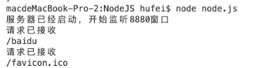
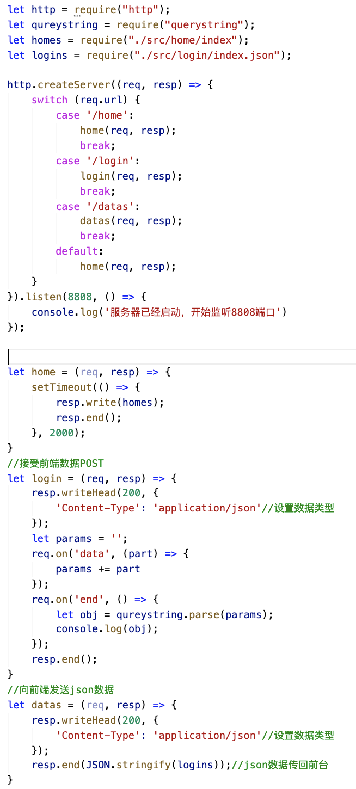
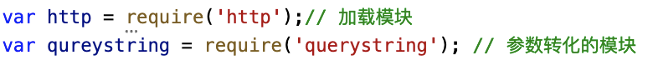

### NodeJs
#### 一.简介
~~~~
基于谷歌浏览器，独立出来的浏览器的JS渲染引擎，不再依赖于浏览器
让JavaScript在服务器端运行的系统环境，即运行JavaScript不再依赖于浏览器
支持ECMScript，不支持DOM和BOM
增加了IO操作（磁盘读取）、数据库操作、获取系统资源、网络操作等
相当于是后端语言了
~~~~

##### 文件执行 在终端写入 node 文件路径
­­­­ 

#### 二.处理HTTP请求
~~~~javascript
// 搭建HTTP服务器，处理HTTP请求并响应
// 1.加载一个HTTP模块，用来创建HTTP服务器
var http = require("http");
// 2.创建一个HTTP服务器
var server = http.createServer(function(request,response){// 参数request表示请求对象，参数response表示响应对象
    // 处理请求
    console.log("请求已接收");
    console.log(request.url);// 请求的地址

    // 响应客户端
    response.writeHead(200,{
         'Content-Type':'text/html;charset=utf-8'
    });// 指定响应头信息,参数是状态码和参数信息
    response.write('<!DOCTYPE html>');
    response.write('<html lang="en">');
    response.write('<head>');
    response.write('    <meta charset="UTF-8">');
    response.write('    <meta name="viewport" content="width=device-width, initial-scale=1.0">');
    response.write('    <title>用户登录</title>');
    response.write('</head>');
    response.write('<body>');
    response.write('   <form action="/login" method="POST">');
    response.write('        姓名<input type="text" name="username"> ');
    response.write('        密码<input type="password" name="password"> ');
    response.write('        <input type="submit" value="登录">');
    response.write('    </form>');
    response.write('</body>');
    response.write('</html>');
    response.end();
});
// 3.启动服务器,参数1表示被监听的端口号,参数2回调函数
server.listen(8880,function(){
    console.log("服务器已经启动，开始监听8880端口");
});

// 终端 node js文件启动服务器
// 文件更新需要先终止服务器再重新启动服务器
~~~~
­­­­  

 

#### 三.搭建后台服务器
~~~~javascript
// 用户登录
var http = require('http');// 加载模块
var qureystring = require('querystring'); // 参数转化的模块
var server = http.createServer(function (request, response) {
    var url = request.url;
    switch (url) {
        case '/show':
            show(request, response);
            break;
        case '/login':
            login(request, response);
            break;
        default:
            response.writeHead(404, {});
            break;
    }
});
server.listen(9090, function () {
    console.log('服务器启动，监听9090端口');
});

function show(requset, response) {
    response.write('<!DOCTYPE html>');
    response.write('<html lang="en">');
    response.write('<head>');
    response.write('    <meta charset="UTF-8">');
    response.write('    <meta name="viewport" content="width=device-width, initial-scale=1.0">');
    response.write('    <title>用户登录</title>');
    response.write('</head>');
    response.write('<body>');
    response.write('   <form action="/login" method="POST">');
    response.write('        姓名<input type="text" name="username"> ');
    response.write('        密码<input type="password" name="password"> ');
    response.write('        <input type="submit" value="登录">');
    response.write('    </form>');
    response.write('</body>');
    response.write('</html>');
    response.end();
}

// 处理登录
function login(request, response) {
    response.writeHead(200, {
        'Content-Type': 'text/html;charset=utf-8'
    });
    // 绑定data事件，每当获得请求参数时触发
    var params = ''; // 存储获取的参数数据
    request.on('data', function (part) {  // part表示每次获取的参数
        params += part;
    });
    // 绑定end事件，当我们的参数请求结束时，触发
    request.on('end', function () {
        // console.log(params);//得到参数是字符串然后用qureystring模块去拆分成字符串username=tom&password=123
        // 然后连接数据库(以下不连数据库)
        var paramsObj = qureystring.parse(params); //可以直接转化成一个键值对的对象,用在POST模式
        if (paramsObj.username == 'tom' && paramsObj.password == '123') {
            response.write('欢迎你' + paramsObj.username);
        } else {
            response.write('用户登录失败');
        }
        response.end();
    });
}
~~~~

­­­­ 
 
#### 四.模块化
~~~~
 模块化是指将一个复杂的项目按照一定的规则拆分成一个个单一的模块，进行组合使用，完成项目开发
 （1）模块的内部队使用者来说是透明的，在模块中内部会进行成员的导出，向外暴露接口
 （2）使用者在使用前加载对应模块，并调用模块提供功能即可
 （3）方便代码的分层开发，保证每个功能模块职能单一
 （4）模块间可能存在依赖关系
 Node使用模块化的方式组织代码结构
 （1）一个模块可以是一个文件，也可以是一个文件夹，但都需要符号规定要求
 （2）模块中的数据和功能需要导出模块才能使用
~~~~

##### 1.文件模块
~~~~
三种形式
 （1）.js文件模块，使用js语法方式进行定义，并通过module.exports或者exports进行模块的导出
 （2）.json文件模块，使用json对象定义数据，当通过require导入模块时，会自动导出定义的json数据
 （3）.node文件模块，使用node.js编译后的二进制文件，不能自行定义
 在Node.js环境中使用module.exports或exports进行模块的导出
 （1）module与exports都是全局对象
 （2）module对象
~~~~

##### 2.模块的导出
~~~~markdown
(1).js结尾的文件模块：
Node内部提供一个Module构造函数，属性如下：
打印输出module,module是一个全局对象
Module {
  id: '.',  //.模块的标识符表示主模块
  path: '/Users/hufei/Desktop/WEB/NodeJS',
  exports: {}, //模块的导出对象
  parent: null, //当前模块的父模块
  filename: '/Users/hufei/Desktop/WEB/NodeJS/text.js', //当前文件的文件名和储存路径
  loaded: false, //模块是否加载完成
  children: [  //当前模块的子模块
    Module {
      id: '/Users/hufei/Desktop/WEB/NodeJS/module/module1.js',
      path: '/Users/hufei/Desktop/WEB/NodeJS/module',
      exports: [Object],
      parent: [Circular],
      filename: '/Users/hufei/Desktop/WEB/NodeJS/module/module1.js',
      loaded: true,
      children: [],
      paths: [Array]
    }
  ],
  paths: [ //加载模块文件的路径顺序
    '/Users/hufei/Desktop/WEB/NodeJS/node_modules',
    '/Users/hufei/Desktop/WEB/node_modules',
    '/Users/hufei/Desktop/node_modules',
    '/Users/hufei/node_modules',
    '/Users/node_modules',
    '/node_modules'
  ]
}
~~~~
~~~~javascript
// 每个js文件就是一个模块
// 每个模块内部都是私有空间，模块之间无法相互访问
var a = 9;
var b = 0;
function c() {
    console.log(a);
}
var d = {
    e: 1,
    f: 2
}
// module.exports = num;//导出成员(成员只有一个，这样写)
// module.exports = {// 多个成员导出
//     a: a,
//     b: b
// }
// 简写（es6）（建议这样写）
module.exports = {
    a, b, c, d
}
//不能这么写，但这样写就是让exports就等于一个新的对象
exports = {
    a, b, c, d
}
//用exports导出
exports.a = a;
exports.b = b;
console.log(module);
console.log(exports);//简单来说 exports就是module.exports,但不是一个东西
~~~~
~~~~
(2).json结尾的文件模块：
文件不需要导出，会自动导出json数据
直接在导入文件中以正确格式导入即可
var module2 = require('./module/module2.json');
~~~~

##### 3.模块的导入
~~~~javascript
/**
 * 1.导入模块时可以省略后缀名
 * 2.但是模块名相同，后缀名不同，省略后缀名时，加载的是.js
 * 3.模块名相同，后缀名不同，省略后缀名时模块的加载顺序 .js -> .json -> .node ->文件夹模块
 */
//使用require()导入模块
var module1 = require('./module/module1.js');
var module1 = require('./module/module1');

var module2 = require('./module/module2.json');
var module2 = require('./module/module2');
~~~~

##### 4.文件夹模块（node项目）
~~~~
（1）
注意：
1.该文件夹下必须拥有index.js或package.json这两个文件中的一个或者都有
2.导入的时候不需要具体到文件名，写到文件夹名即可
3.package.json必须存在一个main属性，是一个入口.js文件,在这个模块下创建这个js文件，导出这个js文件里的东西
  在package.json文件中必须要有一个main属性
  {
    "main":"hufei.js"
  }
  指定在hufei.js文件中导出hufei.js文件中要导出的内容
  module.exports={
    a,b,c,d
  }
4.require('./module/modele3');// 他会自动查找index.js或者package.json文件，他也只认识这两个文件
5.如果index.js和package.json都存在，则package.json优先级更高，index文件失效
6.如果同目录下，模块文件夹名与文件名相同，先执行独立文件
~~~~
~~~~
（2）
package.json文件中的其他属性（有package.json文件表示是一个模块也表示一个单独的node项目）
{   
    "main":"模块的入口文件 一般指向index.js",
    "name":"模块的名字",
    "version": "模块的版本",
    "dependencies": "模块的描述",
    "scripts": {
        "text":"echo my_module",
        "命令名":"模块执行的命令"
    },
    "author": "模块的作者",
    "license": "模块的协议，如ISC",
    "keywords": "关键字"
}
~~~~
~~~~
（3）利用npm命令自动生成package.json项目文件 node package manager
     npm init 之后会引导一步一步创建package.json文件 entry point就是main
     npm init --yes 所有属性的值都是默认值创建package.json文件
~~~~

#### 五.npm的用法

##### （1）模块的分类
###### 1.核心模块，在安装完Node环境后，Node环境自带的模块，可以直接导入使用 比如：http模块、querystring模块 

 ­­­­ 
 
###### 2.第三方模块，使用npm命令从外网（npmjs.com）下载并安装模块 
###### 3.用户定义模块，开发者通过模块定义语法自定义的模块
##### （2）npm用法

###### npm是随同Node.js一起安装的包管理工具，用来安装、卸载、更新软件包/模块等，同时解决软件包之间的依赖关系
~~~~
命令	                   作用	                              备注
npm init --yes	           初始化项目/模块	              在项目更目录下生成package.json
npm install 模块名          下载安装模块	                      切换当项目的更目录下执行，下载后安装模块在node_modules文件中
npm install 模块名@版本号	   下载指定版本的模块并安装	              默认是最新版本
npm install 模块名 -S	   下载并以生产依赖的方式安装	      将模块信息添加到package.json的dependencies（生产依赖）默认
npm install 模块名 -D	   下载并以开发依赖的方式安装	      将模块信息添加到package.json的devDependencies（开发依赖）项目上线无用
npm install 模块名 -g	   全局安装模块(sudo npm install 模块名 -g)	为系统提供全局的功能，存储于node的全局环境中，如less
npm install	           自动根据package.json中的依赖信息进行安装 自动读取package.json文件中的依赖信息并下载安装
npm uninstall 模块名	   卸载项目中的模块	
npm info 模块名	           查看模块描述信息	              版本信息，依赖等
npm update 模块名	   更新模块	
npm run 命令名	           执行指定命令	                      执行package.json文件中的scripts属性的指定命令
~~~~

#### 六.nrm 全局模块，taobao提供的镜像服务器，可以从国内网的服务器下载
~~~~
安装好了以后就会有nrm命令
nrm ls 查看原地址
nrm use 服务器名 使用服务器
nrm test 测试网速
~~~~

#### 七.第三方模块的安装和使用
~~~~
1.官网查找模块
2.安装模块
3.使用模块（require(模块名)导入模块）只有自定义模块加路径
~~~~
~~~~
这是后端语言前端就下载前端的，但前端js不支持require
借助webpack
~~~~