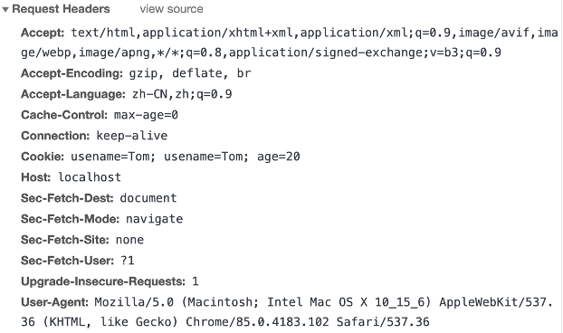
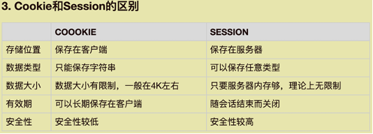
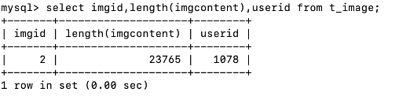

### php
#### 一.简介
~~~~
1.Personal Home Page Hypertext Preprocessor（PHP超文本预处理器）
2.PHP是一种流行的服务器端脚本语言（可以直接运行不需要编译，但是在服务器上运行，客户端运行不了），适用于Web开发，用于创建网站
3.是一门后端语言
4.文件扩展名  .php
~~~~
~~~~html
<?php
     echo "Hello World";
?>
~~~~
~~~~
需要通过服务器来执行
文件全部存在路径 /Library/WebServer/Documents/PHPwork
~~~~
~~~~
可以包含html代码，且html中可以嵌入php代码
用echo输出到客户端
echo可以输出HTML代码如echo '
';
~~~~
#### 二.变量语法

#####  （一）变量
~~~~
   $变量名=变量值;
   命名规范：1变量名以$开头
             2只能由数字、字母、下划线组成，但不能以数字开头
             3建议使用英文单词命名
   $age=18;
   变量
         1.不支持同时定义多个变量（$a=5,$b=4;这是不被允许的）

         2.可变变量（一个变量的变量名可以动态的设置和使用）
          $aa='bb';
          $bb='cc';
          echo $$aa;
          输出的结果就是cc

         3.值传递和引用传递
          $a=111;
          $b=$a;   将值赋给变量，即按值传递
          $c=&$a;  将引用赋给变量，即按引用传递（使用&符号）
          $a=222;
          echo $b;  输出111
          echo $c;  输出222
~~~~

#####  （二）数据类型
~~~~
       1.查看数据类型
echo gettype($n)查看数据类型
var_dump($n)输出变量的类型和值

2.数据类型
       string字符串、int整型、float浮点型、bool布尔、NULL空类型、array数组、object对象
       $a='bb';
       $b=18;
       $c=18.5;
       $d=false;
       $e;
       $d=[1,2,3,4,5]

       3数据类型转化
          (1).(数据类型)变量  将变量转换为指定的数据类型
          (2).转化成bool值---0、空字符串、null会被转化成false、其他值都会转化为true
          (3).echo true; 输出结果是1
          (4).echo false; 输出的结果不会显示
~~~~

#### 三.字符串的处理和常量
~~~~
 1.字符串的拼接
   在php里+不是拼接，使用点号进行拼接（点号左右必须有空格）
   echo 'bb' . 'cc' 输出bbcc
~~~~ 
~~~~
 2.单双引号
  区别，双引号里可以写变量，单引号里写什么都是字符串
  echo “数字：”. $num;
  echo “数字：$num”;   双引号中的变量会被解析
  echo ‘数字：$num’;   单引号中的变量不会被解析，当做普通字符串。效率更高
  echo “数字：{$num}。”;变量与中文进行拼接时，要用{ }分隔，避免引起歧义
~~~~
~~~~
  3.常量（不能改）
    define(变量名,变量值);
define(‘PI’,3,14);
PI=3.14不能改
    常量命名规范
      （1）所有字母都是大写，多个字母之间以下划线连接
           define(“USER_STATUS_ENABLE”,1);
      （2）不需要以$开头

~~~~

#### 四.运算符，选择结构，循环结构
~~~~javascript
和js里几乎是一样
  while循环
    $i=1;
    $sum=0;
    while($i<=100){
        if($i%7==0){
           $sum++;
        }
        $i++;
    }

foreach循环数组
    $names=["tom","jack","luse"];
    foreach($names as $one){
        echo $one;
    }
~~~~
#### 五.php和html的嵌套
~~~~
1.使用php脚本<?php ?>用于执行php代码
<?php
  $name = 1;
  echo “<h2>姓名：$name</h2>”
?>
<h2>姓名：<?php echo $name; ?></h2>
~~~~
~~~~
2.使用php表达式<?=表达式 ？>用于输出表达式的值
  <h2>姓名：<?=$name ?></h2>
~~~~
~~~~
3.if中嵌套html代码 不能直接写
   <?php
     $age = 25;
     if($age>18){
?>
     <h3>你已成年</h3>
  <?php
     }else{
?>
      <h3>你未成年</h3>
<?php
}
?>
~~~~

#### 六.数组

#####   1.定义数组
~~~~
  $arr1=array(值1，值2，值3);
  $arr2=[值1，值2，值3];
~~~~
#####  2.获取元素
~~~~
  echo $arr1[0];
  print_r($arr);输出复杂类型的变量，能看到数组里的元素内容
  count($names);输出数组的元素个数
~~~~
#####  3.可以往数组的末尾加元素
~~~~
  $names[count($names)]=n;
  简写：$names[ ]=n;
~~~~  
#####  4.遍历数组
~~~~
  第一种
  for($i=0;$i<count($names);$i++){
     print_r($names[$i]);
}
  第二种($key是下标，$value是值)
  foreach($names as $key=>$value){
   print_r(“$value : $key” . “ ”);
}
~~~~
#####  5.键值对数组
~~~~
  $arr = [
  键1 => 值1,
  键2 => 值2
  ...
];
~~~~
#####  6.判断数组是否为空
~~~~
   $nums=[ ];
   if($nums){
  echo “不为空”;
}else{
  echo “为空”;
}
~~~~
##### 7.数组函数
~~~~
  （1）count($nums);返回数组中元素的个数

  （2）list($a,$b,$c)=$names; 解构函数然后赋值
       等价于$a=$names[0];
             $b=$names[1];
             $c=$names[2];

  （3）in_array() 判断数组中是否函授指定元素
       in_array(“jack”,$names);

  （4）array_search()查找指定元素第一次出现的位置，有则返回索引，无则返回false
       array_search(“jack”,$names);

  （5）implode()将数组中的元素拆开用指定符号链接，返回字符串
       implode(“#”,$names);

  （6）explode()将字符串按特定符号拆分成数组
       explode(“#”，“hello#world”);

  （7）unset($names[0]);删除元素（索引不删，这样无法是for循环，可以重置索引）

  （8）array_values($names)对数组索引进行重新排序
   ...
~~~~
#### 七.内置函数
~~~~
  （1）phpinfo();返回php的环境信息以及版本信息

  （2）header();设置响应头Headers部分
       header(“Content_Type:text/plain;charset=utf-8”); 设置响应类型或字符集，设置成纯文本
       header(“location:https://www.baidu.com”); 设置地址栏，这里相当于页面跳转至百度

  （3）exit()、die()、return终止脚本的运行，插入到脚本里会终止脚本的运行
       exit(“程序终止”);
       die(“程序终止”);
       return; 写在函数里

  （4）isset()、empty() 判断变量有没有设置返回布尔值
       var_dump(isset($a)); 判断变量是否已经设置，并且是非空，这样就返回true；否则返回false
       var_dump(empty($a)); 判断变量是否为空，或者值是否等于false

  （5）is_类型() 判断值的类型 返回布尔值
       is_string(“3”);
       string字符串、int整型、float浮点型、bool布尔、NULL空类型、array数组、object对象

  （6）sleep() 让程序进入休眠
       sleep(3);暂停三秒

  （7）rand() 产生随机数
       rand(0,9) 产生一个[0，9]之间的整数

  （8）round() 四舍五入，默认不保留小数
       round(3.1415,3) 保留三位小数

  （9）ceil()向上取整 floor()向下取整 ..
       
  （10）echo()、print()、print_r()、var_dump() 输出
        echo(11);
        echo 11,22,33
        print(11)
        print_r($nums) 输出复杂类型的变量
        var_dump($a) 输出类型和值

~~~~
#### 八.字符串函数
~~~~
  （1）strlen(“你好hello”)字符串长度，（按字节算长度，中文一个字是三个字节）//11

  （2）mb_strlen(“你hao”)多字节字符串，（按字符处理）

需要启用多字节字符号串处理模块
在终端输入命令
1.查看已启用模块 php -m
2.启用模块（macOS已经开启）
      1创建php的配置文件 php.ini
      2找到php.ini.default（;开头的是注释，打开）
      3复制php.ini.default，重命名为php.ini
      4.extension_dir=“ext”指定拓展模块的目录
      5.extension=php_mbstring.dll 加载多字节字符串模块
      6.重启Apache

  （3）mb_substr()截取
       mb_substr(“hello你111”,2,4)在字符串中从索引2开始截取截取四个字节

  （4）mb_strpos()子字符串出现的索引
       mb_strpos(“1234”,4);

  （5）str_replace() 替换
       str_replace(“e”,“x”,“hello”);把e换x

  （6）trim()去除首尾的空格

  （7）implode(“-”,array);将数组array里的元素以-连接成一个字符串
~~~~
#### 九.日期函数
~~~~
  （1）time() 返回自Unix纪元1970年1月1日0时0分0秒至当前时间的秒数

  （2）1.临时修改临时时区date_default_timezone_set(“Asia/Shanghai”);设置时区
       2.设置全局时区，对所有页面有效
        编辑php.ini文件
        找到date.timezone     936行
        取消注释后修改date.timezone = Asia/Shanghai
        重启Apache

  （3）date() 对日期时间进行格式化（需要先设置时区）
       date(“Y-m-d H:i:s”); 对当前时间进行格式化
       date(“Y-m-d H:i:s”,time()-7*24*60*60); 七天前的时间进行格式化

  （4）mktime() 返回指定日期的秒数 （参数依次传入时分秒月日年）
       $time=mktime(20,00,00,8,8,2008)返回秒值
       date(“Y-m-d H:i:s”,$time); 2008年8月8日20：00：00

~~~~
#### 十.正则表达式函数
~~~~
  （1）preg_match() 判断字符串是否匹配对应的正则规则（类似与js里的text） 返回1表示匹配，不匹配返回0
       preg_match(“/hello$/”,“helloworld”)

  （2）preg_replace() 替换
       echo preg_replace(“/\d{4}$/”,“****”，“13237463678”) 电话末尾换成****
~~~~

#### 十一.自定义函数function
~~~~
  1.function 函数名(参数1,参数2,...){
         函数体
}
  函数名();

2.参数可以有默认值，
  function 函数名(参数1,参数2=参数2的默认值.){
         函数体
}
  此时参数2就有默认值，那调用函数时就可以传，也可以不传参数（必填的参数靠前，有默认值的参数写在靠后）

  3参数长度不确定
   function fn($a,$b,...$args){
       函数体
}
   fn($a的参数值,$b参数值,然后可以传入任意个值)
   $a和$b是普通参数
   $args是一个数组

  4.引用参数，在函数形参前添加&，表示引用参数，在函数内对引用参数的修改，在函数外可以获取到,相当于储存的地址相同了，引用参数既可以传入值，也可以返回值
function fn(&$a,&$b){

}

  5.函数内不能直接访问函数外的全局变量
   如何使用全局变量
   $num=5;
function fn(){
      global $num; //通过global引用全局变量
      echo $num;
}
   这样就可以使用全局变量

  6.函数的静态变量，只在函数第一次被调用时初始化，之后不再初始化，实现变量共享
   function fn(){
    static $count = 1; //只有第一调用会执行，这一条之后就不会再执行
    echo $count;
    $count++;
}
fn();  //1
fn();  //2

  7.动态调用函数，根据外部传入的函数名来决定要调用的函数
   function hello($name){
   echo “hello”;
}
   function world($name){
   echo “world”;
}
   $method = “hello”;  //定义函数名字是hello
   $name=tom;
   method($name);

~~~~

#### 十二.访问MySQL
~~~~javascript
（1）mysql_connect(数据库地址和端口，账号，密码，数据库名字); 连接数据库，如果连接成功返回mysqli Object对象，如果连接失败返回false
     重新配置root密码
     1. mysql> ALTER USER 'root'@'localhost' IDENTIFIED WITH mysql_native_password BY '824166449';
     2. flush privileges; 更新命令
     3. $conn = mysqli_connect("localhost:3306", "root", "824166449", "test");     

<pre>是用于格式化代码
         <pre>
           <?php 
           访问数据库
           $conn = mysqli_connect("localhost:3306", "root", "824166449", "test");
           print_r($conn);
           ?>
</pre>
          输出：
           mysqli Object
(
           [affected_rows] => 0
           [client_info] => mysqlnd 5.0.12-dev - 20150407 - $Id: 7cc7cc96e675f6d72e5cf0f267f48e167c2abb23 $
           [client_version] => 50012  客户端的版本
           [connect_errno] => 0  连接的错误码0就是没有错误
           [connect_error] => 
           [errno] => 0  
           [error] => 
           [error_list] => Array
               (
               )
           [field_count] => 0
           [host_info] => localhost:3306 via TCP/IP  主机的地址
           [info] => 
           [insert_id] => 0
           [server_info] => 8.0.21  
           [server_version] => 80021  服务器的版本
           [stat] => Uptime: 1222536  Threads: 2  Questions: 598  Slow queries: 0  Opens: 380  Flush tables: 3  Open tables: 285  Queries per second avg: 0.000
           [sqlstate] => 00000 状态
           [protocol_version] => 10
           [thread_id] => 60
           [warning_count] => 0
)

  （2）mysqli_connect_error($conn)获取连接的时的错误信息

  （3）mysqli_connect_errno($conn)获取连接时的错误码，如果连接成功返回0，如果失败返回非0的数字

  （4）mysqli_query()执行数据库操作，如增删改查操作，事务操作
       1、增删改操作（切记把连接数据成功作为第一个参数，返回一个布尔值，成功返回true，失败返回false）
       $sql="insert into dept (deptno,dname,loc) values (50,'市场部','南京')";
       $result=mysqli_query($conn,$sql);  
       2、查询操作 （成功返回一个查询得到的mysqli_result Object对象，失败返回false）
       $sql= "select".
            "   deptno,dname,loc".
            "from".
            "   dept";
       $result=mysqli_query($conn,$sql);

  （5）mysqli_close()关闭连接
       mysqli_close($conn);

  （6）mysqli_error()获取执行时的错误信息
       mysqli_error($conn); 

  （7）mysqli_insert_id()获取插入时生成的主键，主键会自动增长
       $sql= "insert into dept".
            "   (deptno,dname,loc)".
            "values".
            "   (50, 市场部','南京')";
       $result=mysqli_query($conn,$sql); 获取返回的主键
       if($result){
   echo mysql_insert_id($conn);
}else{
echo mysqli_error($conn);
}

  （8）mysqli_fetch_assos()从查询的结果中读取一行数据，每次获取一行，返回一个键值数组，列名为key，列值为value，调用几次返回几组键值数组，当获取不到时，返回null，利用循环获取
       $sql= "select".
            "   deptno,dname,loc".
            "from".
            "   dept";
       $result=mysqli_query($conn,$sql);
       if($result){
  print_r(mysqli_fetch_assoc($result));
  循环：
  while($row= mysqli_fetch_assoc($result)){
   print_r($row);
   echo “ ”;
}
}else{
  echo mysqli_error($conn);
}

  （9）mysqli_num_rows()获取结果集中行的数量
       $sql= "select".
            "   deptno,dname,loc".
            "from".
            "   dept";
       $result=mysqli_query($conn,$sql);
       if($result){
  while($row= mysqli_fetch_assoc($result)){
   print_r($row);
   echo “ ”;
}
echo mysqli_num_rows($result); 获取总行数
}else{
  echo mysqli_error($conn);
}
~~~~
#### 十三.事务操作transaction
~~~~
转账是一个事务，由两个sal操作所组成，如张三给李四转账
    $conn= mysqli_connect("localhost:3306", "root", "824166449", "test");
    一次性插入三条数据,要么都插入，要么都插入失败
mysqli_query($conn, "begin");  (开启事务)
$flag=true;  (用于标识程序执行是否正常，true表示正常)
$dnames=["a1","b1","c1"];
foreach($dnames as $dname){
  $sql="insert into dept"
       "   (deptno,dname)"
       "values"
       "   (".rand(100,99) . ",'$dname')";
  mysqli_query($conn,$sql);
  if(mysqli_errno($conn)!=0){
  $flag=false;
}
}
if($flag){
   mysqli_query($conn, "commit"); (提交事务)
   echo "success";
}else{
   echo mysqli_query($conn, "rollback"); (回滚事务)
   echo "rollback";
}
~~~~

#### 十四.状态管理
~~~~
（一）Cookie客户端储存
1.写Cookie（都是字符串）
调用函数 setcookie(key,value,expire,path)
   1.key 键
   2.value 值
   3.expire 表示有效时间，指定1970-1-1至今的秒数，默认当会话结束时Cookie过期
setcookie("usename","Tom",time()+7*24*60*60);保存七天
   4.path 表示访问路径，只有当该路径下文件访问时才会携带当前Cookie数据，默认是为写入Cookie的文件所在的路径
setcookie("usename","Tom",time()+7*24*60*60, "/");根目录
(重要提示：
方法一：
PHP里Cookie的使用是有一些限制的。
1、使用setcookie必须在<html>标签之前
2、使用setcookie之前，不可以使用echo输入内容
3、直到网页被加载完后，cookie才会出现
4、setcookie必须放到任何资料输出浏览器前，才送出
.....
由于上面的限制，在使用setcookie()函数时，学会遇到 "Undefined index"、"Cannot modify header information - headers already sent by"…等问题，解决办法是在输出内容之前，产生cookie，可以在程序的最上方加入函数 ob_start();
ob_start ：打开输出缓冲区
函数格式：void ob_start(void)
说明：当缓冲区激活时，所有来自PHP程序的非文件头信息均不会发送，而是保存在内部缓冲区。为了输出缓冲区的内容，可以使用ob_end_flush()或flush()输出缓冲区的内容。
方法二：
解决Warning: Cannot modify header information - headers already sent by ...... 前几天装了个php的大头贴系统测试，发现报错Warning: Cannot modify header information - headers already sent by ......
今天又装openads，还是出现这个问题。怒了。上网找了半天，有人说要在文件开头写上
ob_start();
失败。
后来打开 php.ini 然后把 output_buffering 设为 on 。重起appache，OK。看来这才是解决办法。
特别注意：
如果使用utf-8编码，一定要去掉UTF-8中的BOM，这都是因为utf-8编码文件含有的BOM原因，而php4,5都是不支持BOM的。去掉bom，可以用Notepad++打开转换一下。（我就是看了这个才解决问题的）
用PHP的ob_start(); 控制您的浏览器cache 。)

2.读Cookie
请求所有该路径下的（该网站localhost/PHPwork）的Cookie数据 $_COOKIE
$_COOKIE是一个数组
foreach($_COOKIE as $key=>$value){
    print_r($key . ":" . $value . " ");
}
请求头里就有Cookie
~~~~

­­­­ 

~~~~
3.删除Cookie
setcookie("usename","null");

（二）Session（表示用户会话，一个会话就是浏览器与服务器之间的一次通话，包含浏览器与服务器之间的多次请求，响应过程）
      Session响应的id存在Cookie，key为PHPSESSID，根据id去服务器取数据

  1.启动Session 
session_start();

  2.获取Session的id
session_id();
 
  3.向Session中存数据
$_SESSION[key]=value;
key表示键，只能是字符串
value表示值，可以任意类型

  4.获取Session中的数据
$_SESSION
取出当前地址下的所有数据，是一个数组

  5.删除Session的数据
unset($_SESSION[key]);

  6.清空Session，是Session失效，注销时使用
   session_destroy();
~~~~

­­­­  

#### 十五.表单的处理
~~~~javascript
（1）通过表单发送请求
  表单元素必须具有name属性
  复选框的name属性值要加[ ]，表示提交有多个值
  <input type="checkbox" name="ufavs[ ]" value="eat">
  <input type="checkbox" name="ufavs[ ]" value="game">
  <input type="checkbox" name="ufavs[ ]" value="sleep">

（2）用法
  $_GET 获得GET请求方式的数据
  $_POST 获得POST请求方式的数据
  $_REQUEST 获得GET/POST请求方法的数据
$user = [];
$user["uname"] = $_POST["uname"]; //用户名
$user["upass"] = $_POST["upass"]; //密码
$user["ugender"] = $_POST["ugender"]; //性别
$user["ufavs"] = implode(',', $_POST["ufavs"]); //爱好，以逗号拼接
$user["ucourseid"] = $_POST["ucourseid"]; //课程id
$user["uclassid"] = $_POST["uclassid"]; //班级id
$user["udesc"] = $_POST["desc"]; //描述
$flag = insertUser($user);
~~~~
#### 十六.php的文件引用
~~~~javascript
  在php文件中可以引入其他的php文件
  1.require引入文件错误时，停止执行，并返回一个致命错误E-COMPILE_ERROR(推荐)
   require “文件名”;
  2.include引入文件错误时，继续执行，并返回一个警告E-WARNING
   require “文件名”;
  查询所有课程信息
function selectAllCourse()
{
      $sql = "select courseid,coursename from t_course";
      $conn = mysqli_connect("localhost:3306", "root", "824166449", "php");
      $result = mysqli_query($conn, $sql);
      $courses = [];
      while ($course = mysqli_fetch_assoc($result)) {
          $courses[] = $course;
      }
      mysqli_close($conn);
      return $courses;
}
~~~~
#### 十七.文件上传
~~~~javascript
  上传图片
  （1）.必须以post方式请求
   指定表单提交内容类型 enctype=“multipart/form-data”
  <form action="regist_service.php" method="POST" enctype="multipart/form-data">

（2）.对图片文件上传
<input type="file" name="uimage" id="uimage" accept=".png, .jpg, .jpeg, .gif, .bnp">
 
  （3）.设置默认的背景图片
  <input type="file" name="uimage" id="uimage" accept=".png, .jpg, .jpeg, .gif, .bnp" multiple>
        <!-- 用label关联image和input label的属性for等于input的属性id -->
        <label for="uimage">
            <!-- 缩略图 -->
             
        </label>
   
（4）.css设置
#thum {
            max-width: 100px;
            max-height: 100px;
            cursor: pointer;
        }
        input[type="file"]{
            display: none; //隐藏input用关联的img取代其功能
        }
  （5）.对上传的图片进行限制以及缩略图展示
$(function() {
            // 对上传的图片进行限制
            $('#uimage').change(function() {
                var target = this.files[0];
                if (/\.jpg|\.jpeg|\.png|\.gif|\.bmp$/i.test(target.name)) {
                    // 选中图片取代默认图片
                    $("#thum").attr("src",window.URL.createObjectURL(target)); //只能用这种格式的路径去上传图片
                } else {
                    $("#uimage_error").text("图片格式错误").addClass("errorMsg");
                }
            });
        })

 路径分类
   （1）绝对路径（推荐）
         以正斜杠/开始的路径，在项目的根目录下查找（Apache的httpd.conf中配置的DocumentRoot路径）
   （2）相对路径
         除绝对路径以外的路径，相对于当前文件的位置
         (require引入文件只能使用相对位置)

  上传图片等文件到后台
$_FILES 不同于文本的获取表单提交的文件数据
$_FILES["uimage"]["name"];文件名
$_FILES["uimage"]["type"];文件类型
$_FILES["uimage"]["size"];文件大小
$_FILES["uimage"]["tmp_name"];文件临时存储位置
$_FILES["uimage"]["error"];文件上传的错误码，0表示没有错误

move_uploaded_file() 把上传的文件移动到新位置
move_uploaded_file($_FILES["uimage"]["tmp_name"],"uploads/" . rand(1000,9999) . "-" . $_FILES["uimage"]["name"]);
文件从临时存储地放入指定文件夹upload（文件夹在电脑硬盘开启读和写的权限）中，存储的名字为随机数+"-"+文件的原名
也可以存数据库里（二进制数用blob存）

fopen() 打开一个文件
filesize() 返回指定文件的大小，单位为字节
fread() 读取打开的文件，返回读取的字符串（既可以读取文本文件也可以读取二进制文件）
addslashes() 将字符串的特殊字符进行转义，用于为存储在数据库的字符串以及数据库查询语句准备合适的字符串
   fclose()关闭文件
添加用户 返回布尔值true或是false
function insertUser($user)
{
       $conn = mysqli_connect("localhost:3306", "root", "824166449", "php");
       开启事务
       mysqli_query($conn,"begin");
       $flag=true;//用于标识运行是否正常
       1.将用户的基本信息添加到数据库t_user表
       $sql = "insert into t_user " .
           "(uname,upass,ugender,ufavs,udesc,ucourseid,uclassid) " .
           "values " .
           "('{$user["uname"]}','{$user["upass"]}','{$user["ugender"]}','{$user["ufavs"]}','{$user["udesc"]}','{$user["ucourseid"]}','{$user["uclassid"]}')";
       mysqli_query($conn, $sql);
       $userid =mysqli_insert_id($conn);//获取主键id
       if(mysqli_errno($conn)){
           $flag=false;
           echo mysqli_error($conn);
       }
   
       2.将图片文件保存到数据库t_image表（两步都成功才能成功）
       if($user["uimage"]["error"]==0){
           $target=$user["uimage"]["tmp_name"];
           以二进制的方式打开文件准备进行操作, rb代表读二进制文件
           $file=fopen($target,"rb");rb代表读二进制文件
           获取文件字节数
           $size=filesize($target);
           读取$size长度的内容到内存
           $content=fread($file,$size);
           转义，避免和数据库语言冲突字符
           $content=addslashes($content);
           关闭文件
           fclose($file);
           将$content存入t_image表的imgcontent列
           $sql="insert into t_image (imgcontent,userid) values ('$content','$userid')";
           mysqli_query($conn,$sql);
           if(mysqli_errno($conn)){
               $flag=false;
               echo mysqli_error($conn);
           }
       }
        判断前面两部是否出现错误，决定提交或回滚
       if ($flag) {
           mysqli_query($conn,"commit");
       } else {
           mysqli_query($conn,"rollback");
       }
       mysqli_close($conn);
       return $flag;
}
~~~~
­­­­ 
#### 十八.用户登录
~~~~javascript
（1）
根据从登录页面的获取的用户名和密码，匹配数据库里的用户名和密码，返回$user,匹配不到返回null，匹配到返回一个用户信息的数组
function selectByNameAndPass($uname, $upass)
{
    $sql = "select userid,uname,ugender,ufavs,udesc,ucourseid,uclassid from t_user where uname='$uname' and upass='$upass'";
    $conn = mysqli_connect("localhost:3306", "root", "824166449", "php");
    $result = mysqli_query($conn, $sql);
    $user=null;//查询的结果保存的这个数据中输出
    判断能否获得结果，如果匹配成功返回数据的行数是1，如果没匹配到结果返回的数据是0
    if (mysqli_num_rows($result) == 1) {
        读取数据
        $row = mysqli_fetch_assoc($result);
        $user["userid"]=$row["userid"];
        $user["uname"]=$row["uname"];
        $user["ugender"]=$row["ugender"];
        $user["ufavs"]=explode(",",$row["ufavs"]);//拆分成数组
        $user["udesc"]=$row["udesc"];
        $user["ucourseid"]=$row["ucourseid"];
        $user["uclassid"]=$row["uclassid"];
    }
    mysqli_close($conn);
    return $user;
}
（2）
<?php
require "user_DAO.php";
获取登录时输入的数据(这里是用户名和密码)
$uname = $_POST["uname"];
$upass = $_POST["upass"];
// 查询数据库
$user = selectByNameAndPass($uname, $upass);
// 登录判断
if ($user) {
    将用户的信息存到session中
    session_start();
    $_SESSION["user"]=$user;
    登录成功
    header("location:list.php");
} else {
    登录失败
    header("location:login.php?errorMsg=用户名或密码不正确");
}
?>
（3）
<?php
获取session中的用户信息（形成会话，会话结束session失效）
   session_start();
   $user=$_SESSION["user"];
?>
~~~~

#### 十九.读取用户的全部信息
~~~~javascript
function selectAllUser()
{
    $sql = "select userid,uname,ugender,ufavs,udesc,coursename,classname from t_user u left join t_course c on u.ucourseid=c.courseid left join t_class l on u.uclassid=l.classid order by userid";
    $conn = mysqli_connect("localhost:3306", "root", "824166449", "php");
    $result = mysqli_query($conn, $sql);
    $users=[];
    循环输出
    while ($row = mysqli_fetch_assoc($result)) {
        把每一行存到数组里
        $users[]=$row;
    }
    return $users;
    mysqli_close($conn);
}
~~~~
#### 二十.分页显示
~~~~javascript

            <a href="list.php?pageNo=1" class="btn-page">首页</a>
            <a href="list.php?pageNo=<?= $pageNo > 1 ? $pageNo - 1 : 1 ?>" class="btn-page">上一页</a>
            <?php
            for ($i = 1; $i <= $pageTotal; $i++) {
            ?>
                <a href="list.php?pageNo=<?= $i ?>" class="btn-page <?= $i == $pageNo ? 'current' : '' ?>"><?= $i ?></a>
            <?php
            }
            ?>
            <a href="list.php?pageNo=<?= $pageNo < $pageTotal ? $pageNo + 1 : $pageTotal ?>" class="btn-page">下一页</a>
            <a href="list.php?pageNo=<?= $pageTotal ?>" class="btn-page">末页</a>
        

/* 当前选中页的页标样式 */
        .current {
            color: #fff;
            background-color: #f70;
        }

/*
分页获取信息
判断有没有传入页码，没有传入默认为1
*/
if (isset($_REQUEST["pageNo"])) {
    $pageNo = $_REQUEST["pageNo"];
} else {
    $pageNo = 1;
}
$pageSize = 10; //每页显示1条信息
$users = selectPage($pageNo, $pageSize, $pageTotal);

/*
分页查询用户信息 三个参数
1.页码，
2.每页显示多少
3.引用参数（在外面可以获取到）&$pageTotal一共多少页
*/
function selectPage($pageNo,$pageSize,&$pageTotal)
{
    $sql = "select userid,uname,ugender,ufavs,udesc,coursename,classname from t_user u left join t_course c on u.ucourseid=c.courseid left join t_class l on u.uclassid=l.classid order by userid limit ". ($pageNo-1)*$pageSize . ",$pageSize";
    $conn = mysqli_connect("localhost:3306", "root", "824166449", "php");
    $result = mysqli_query($conn, $sql);
    $users=[];
    // 循环输出
    while ($row = mysqli_fetch_assoc($result)) {
        // 把每一行存到数组里
        $users[]=$row;
    }
    // 计算总页数
    $sql= "select ceil(count(userid)/$pageSize) pageTotal from t_user";
    $result = mysqli_query($conn, $sql);
    $row=mysqli_fetch_assoc($result);
    $pageTotal=$row["pageTotal"];
    return $users;
    mysqli_close($conn);
}
~~~~

#### 二十一.删除操作（通过userid）
~~~~javascript
<a href="list.php?userid=<?= $user["userid"] ?>" class="btn">删除</a>

将user里的userid存在session中

根据userid删除用户
function deleteById($userid)
{
    $conn = mysqli_connect("localhost:3306", "root", "824166449", "php");
    mysqli_query($conn, "begin");
    $flag = true; //判断事务是否正常执行
    // 先删从表里t_image的信息
    $sql = "delete from t_image where userid=$userid";
    mysqli_query($conn, $sql);
    if (mysqli_errno($conn)) {
        $flag = false;
    }
    // 再删主表里t_user的信息
    $sql = "delete from t_user where userid=$userid";
    mysqli_query($conn, $sql);
    if (mysqli_errno($conn)) {
        $flag = false;
    }
    // 判断前面两部是否出现错误，决定提交或回滚
    if ($flag) {
        mysqli_query($conn, "commit");
    } else {
        mysqli_query($conn, "rollback");
    }
    mysqli_close($conn);
    return $flag;
}

存session
session_start();
$_SESSION["user"]=$user;

取session
session_start();
$user = $_SESSION["user"];

// 删除操作
$userid = $_REQUEST["userid"];
if($userid){
    deleteById(intval($userid));
    header("location:list.php");//刷新页面
}
~~~~

#### 二十二.读取信息显示消息
~~~~javascript
读取文本信息
function selectById($userid)
{
    $sql = "select userid,uname,ugender,ufavs,udesc,ucourseid,uclassid from t_user where userid=$userid";
    $conn = mysqli_connect("localhost:3306", "root", "824166449", "php");
    $result = mysqli_query($conn, $sql);
    $user = null; //查询的结果保存的这个数据中输出
    // 判断能否获得结果，如果匹配成功返回数据的行数是1，如果没匹配到结果返回的数据是0
    if (mysqli_num_rows($result) == 1) {
        // 读取数据
        $row = mysqli_fetch_assoc($result);
        $user["userid"] = $row["userid"];
        $user["uname"] = $row["uname"];
        $user["ugender"] = $row["ugender"];
        $user["ufavs"] = explode(",", $row["ufavs"]); //拆分成数组
        $user["udesc"] = $row["udesc"];
        $user["ucourseid"] = $row["ucourseid"];
        $user["uclassid"] = $row["uclassid"];
    }
    mysqli_close($conn);
    return $user;
}

$user = selectById($userid);

用户：<input type="text" name="uname" value="<?= $user['uname'] ?>"> 
            性别：<input type="radio" name="ugender" value="male" <?= $user["ugender"] == "male" ? "checked" : "" ?>>男
            <input type="radio" name="ugender" value="female" <?= $user["ugender"] == "female" ? "checked" : "" ?>>女 
            爱好：<input type="checkbox" name="ufavs[]" value="eat" <?= in_array("eat", $user["ufavs"]) ? "checked" : "" ?>>吃饭
            <input type="checkbox" name="ufavs[]" value="game" <?= in_array("game", $user["ufavs"]) ? "checked" : "" ?>>游戏
            <input type="checkbox" name="ufavs[]" value="sleep" <?= in_array("sleep", $user["ufavs"]) ? "checked" : "" ?>>睡觉 
            课程：<select name="ucourseid">
                <option value="0">请选择课程</option>
                <?php
                foreach ($courses as $course) {
                ?>
                    <option value='<?= $course["courseid"] ?>' <?= $user["ucourseid"] == $course["courseid"] ? "selected" : "" ?>><?= $course["coursename"] ?></option>
                <?php
                }
                ?>
            </select> 
            班级：<select name="uclassid">
                <option value="0">请选择班级</option>
                <?php
                foreach ($classes as $class) {
                    echo "<option value='{$class["classid"]}' " . ($user["uclassid"] == $class["classid"] ? "selected" : "") . ">{$class["classname"]}</option>";
                }
                ?>
            </select> 
            简介：<textarea name="desc" cols="30" rows="5"><?= $user["udesc"] ?></textarea> 

读取图片信息
" id="thum">

$userid = $_REQUEST["userid"];
// $userid = 1098;
$sql = "select imgcontent from t_image where userid=$userid";
$conn = mysqli_connect("localhost:3306", "root", "824166449", "php");
$result = mysqli_query($conn, $sql);
$row = mysqli_fetch_assoc($result);
$content = $row["imgcontent"];
// 设置头部
header("content-type:image");
// 输出图片
echo $content;

重新提交后台
<!-- 写一条隐藏的userid的信息 -->
<input type="hidden" name="userid" value="<?= $user["userid"] ?>">

修改后更新数据
function updateUser($user){
    $conn = mysqli_connect("localhost:3306", "root", "824166449", "php");
    // 开启事务
    mysqli_query($conn, "begin");
    $flag = true; //用于标识运行是否正常
    // 1.修改t_user表
    $sql = "update t_user set uname='{$user["uname"]}',ugender='{$user["ugender"]}',ufavs='{$user["ufavs"]}',udesc='{$user["udesc"]}',ucourseid='{$user["ucourseid"]}',uclassid='{$user["uclassid"]}' where userid={$user["userid"]}";
    mysqli_query($conn, $sql);
    if (mysqli_errno($conn)) {
        $flag = false;
        echo mysqli_error($conn);
    }

    // 2.修改t_image表（两步都成功才能成功）
    if ($user["uimage"]["error"] == 0) {
        $target = $user["uimage"]["tmp_name"];
        // 以二进制的方式打开文件准备进行操作
        $file = fopen($target, "rb"); //rb代表读二进制文件
        // 获取文件字节数
        $size = filesize($target);
        // 读取$size长度的内容到内存
        $imgBlob = fread($file, $size);
        // 转义，避免和数据库语言冲突字符
        $content = addslashes($imgBlob);
        // 关闭文件
        fclose($file);
        // 将$content存入t_image表的imgcontent列
        $sql = "update t_image set imgcontent='$content' where userid={$user["userid"]}";
        mysqli_query($conn, $sql);
        if (mysqli_errno($conn)) {
            $flag = false;
            echo mysqli_error($conn);
        }
    }
    // 判断前面两部是否出现错误，决定提交或回滚
    if ($flag) {
        mysqli_query($conn, "commit");
    } else {
        mysqli_query($conn, "rollback");
    }
    mysqli_close($conn);
    return $flag;
}

<!-- 修改后提交新数据到数据库 -->
<?php
// 引入文件
require "user_DAO.php";
// 获取用户注册数据
$user = [];
$user["userid"] = $_POST["userid"];
$user["uname"] = $_POST["uname"]; //用户名
$user["ugender"] = $_POST["ugender"]; //性别
$user["ufavs"] = implode(',', $_POST["ufavs"]); //爱好，以逗号拼接
$user["ucourseid"] = $_POST["ucourseid"]; //课程id
$user["uclassid"] = $_POST["uclassid"]; //班级id
$user["udesc"] = $_POST["desc"]; //描述
$user["uimage"] = $_FILES["uimage"]; //头像图片
// 存入数据库
$flag = updateUser($user); //user_DAO.php
if ($flag) {
?>
    
<?php
} else {
?>
    
<?php
}
?>

如果起初没有上床图片那就无法修改图片
~~~~