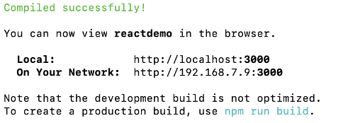
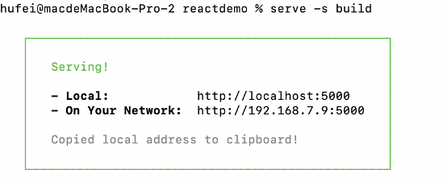
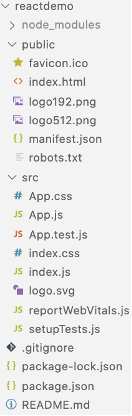
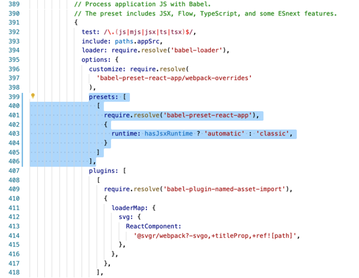

### react
#### 一.终端在创建react项目
~~~~
create-react-app 项目名
~~~~

#### 二. 
~~~~
npm run start 进入开发者模式，就是运行程序，端口号3000就是开发者模式端口
~~~~ 

~~~~
npm run eject让封闭的webpack显示,显示config文件夹和scripts文件夹，这样启动后会报错ReferenceError: React is not defined
再次npm run start出错的话，那么删除node-modules包
然后npm install  是根据package.json依赖去下载对应的依赖
~~~~
~~~~
npm run build 产生的build文件夹，也就是生产者文件
~~~~

##### serviceWorker
~~~~
是在后台运行的一个线程，可以用来处理离线缓存，消息推送、后台自动更新等任务，serviceWork.js就是为react项目注册了一个service worker，用来做资源的缓存，这样就可以在下次访问时，就可以更快的获取资源，而且因为资源的缓存，这样在离线的情况下也可以访问应用（此时使用的资源是之前缓存的资源）
注意：serviceWorker只在生成环境生效（process.env.NOFR_ENV==="production"）
~~~~
~~~~
serve -s build 就可以自己创建服务器，然后可以在浏览器访问，5000就是生产者环境端口号，开发者3000
~~~~ 

##### src里的App.js文件（入口文件）

~~~~jsx
function App() {
  return (
    

      <header>
        
        

           Edit <code>src/App.js</code> and save to reload
        

        <a
           className="App_link"
           href="https://reactjs.org"
           target="_blank"
           rel="noopener noreferrer"//解决安全问题
        >
           Learn React
        </a>
      </header>
    

  )  
}
~~~~
 
###### 所有的a标签都要加noopener noreferrer
~~~~html
<a href="https://reactjs.org" target="_blank" rel="noopener noreferrer" > Learn React </a>
~~~~
~~~~
noopener 一般都是搭配target="_blank"同时使用，因为target="_blank"也是一个安全漏洞：新的页面可以通过window.opener访问窗口对象，并且可以使用window.opener.location = newURL 将网址导航至不同的网址，新页面将于自己的页面处于同一进程上运行，如果新页面正在执行大的JavaScript，自己的页面性能会受影响
noreferrer属性则是为了兼容旧版本的浏览器，功能是一样的
简单说就是防止钓鱼网站
~~~~

#### 三.react官方脚手架
##### 1.初始项目结构
 

##### 2.报错提示

~~~~
释放出webpack.config.js后npm run start会报ReferenceError: React is not defined错误，
修正方法
在webpack.config.js文件的400行左右加
~~~~

~~~~js 
presets: [
    [
        require.resolve('babel-preset-react-app'),
        {
           runtime: hasJsxRuntime ? 'automatic' : 'classic',
        }
    ]
]
~~~~

#### 四.JSX（面试）
~~~~
JSX是一种JavaScript的一种语法扩展，并拥有JavaScript的全部功能
JSX生产React元素，你可以将任何的JavaScript表达式封装在花括号里，然后将其嵌入搭配JSX中。在编译之后，JSX表达式就变成了常规的JavaScript对象，这意味着可以在if语句和for循环里使用JSX，将它赋值给变量，接受它作为参数，并从函数中返回它，利用JSX实现虚拟DOM
~~~~
~~~~jsx
var React = require('react');
var ReactDOM = require('react-dom');
class Index extends React.Component{
   render(){
     const name = "Tom"
     return (
        

           Hello {name}!
        

     )
   }
}
ReactDom.render(<Inder/>,document.getElementById('app'));
~~~~

#### 五.index.html（总入口文件）

###### %PUBLIC_URL%模板引擎，代表公共路径，默认寻找站点的根目录，这里就是相当于/，因为图片和index.html处在一个文件夹，后面是网站图标文件
~~~~html
<link rel="icon" href="%PUBLIC_URL%/favicon.ico" />
~~~~
###### 移动端适配
~~~~html
<meta name="viewport" content="width=device-width, initial-scale=1.0, maximum-scale=1.0, user-scalable=no" />
~~~~
###### 格式化电话邮件等等，不会再发生自动识别出现a标签
~~~~html
<meta name="format-detection" content="telephone=no, email=no, date=no, address=no">
~~~~
###### 主题颜色
~~~~html
<meta name="theme-color" content="#000000" />
~~~~
###### 关闭ie的兼容性模式
~~~~html
<meta http-equiv="X-UA-Compatible" content="IE=edge, chrome=1">
~~~~
###### 图标添加到桌面
~~~~html
<link rel="apple-touch-icon" href="%PUBLIC_URL%/logo192.png" />
~~~~
###### 图标添加到桌面，会根据设备添加不同的尺寸
~~~~html
<link rel="manifest" href="%PUBLIC_URL%/manifest.json" />
~~~~

#### 六.重新配置

##### 1.在src里新建文件夹pages和文件夹assets，pages放路由文件，assets放资源文件，包括组件，css等文件
~~~~
将不需要的App.css和图标文件删除
入口文件App.js
删除初始样式的内容
~~~~

~~~~jsx
import React from "react";

function App() {
  return(
    

       ...
    

  )  
}
~~~~
 
##### 2.在assets文件夹中创建css文件夹，在css文件夹里创建common文件夹，创建public.css，将index.css里的公共样式复制到public.css里，再添加一部分公共样式在里面
~~~~css
html,body{
  margin: 0;
  padding: 0;
  font-family: -apple-system, BlinkMacSystemFont, 'Segoe UI', 'Roboto', 'Oxygen',
  'Ubuntu', 'Cantarell', 'Fira Sans', 'Droid Sans', 'Helvetica Neue', sans-serif;
  -webkit-font-smoothing: antialiased;
  -moz-osx-font-smoothing: grayscale;
}
code{
  font-family: source-code-pro, Menlo, Monaco, Consolas, 'Courier New', monospace;
}
~~~~

##### 3.删除index.css文件，修改index.js里css的引用
~~~~jsx
import React from "react";
import ReactDom from "react-dom";
import "./css";
import App from  "./App";
import reportWebVitals from "./reportWebVitals"
~~~~ 

##### 4.将App.js从无状态组件改成有状态组件
~~~~jsx
import React from "react";

class App extends React.Component{
   render(){
     return (
        

           ...
        

     )
   }
}
export default App
~~~~
##### 5.在src文件夹里新建components，这是用来放所有组件文件夹（一个组件文件夹对象一个index.js文件），再在里面创建header文件夹（组件文件夹），创建组件文件index.js

~~~~jsx
import React from "react";

class Header extends React.Component{
   render(){
     return (
        

           ...
        

     )
   }
}
export default Header
~~~~ 
###### 引入到入口App.js
~~~~jsx
import React from "react";
import Header from "./components/header";

class App extends React.Component{
   componentDidMount() {
      //获取h2的方法
      //方法一:
      console.log(this.refs["react"]);
      //方法二:
      console.log(this.refs.react);
   }
   render(){
     var content ="jack&nbsp;lee"
     return (
        

           <Header/>
           <h2 ref="react" style={{color: "#F40"}}>react study</h2>
           

        

     )
   }
}
export default App
~~~~ 

#### 七.让JSX能认识HTML标签
~~~~
var content ="jack&nbsp;lee"

~~~~
~~~~jsx
import React from "react";

class App extends React.Component{
   render(){
     var content ="jack&nbsp;lee"
     return (
        

           

        

     )
   }
}
export default App
~~~~

#### 八.Ref的使用 获取DOM（只能获取本组件的DOM）
~~~~
document.getElementsById 也能获取
~~~~
~~~~jsx
import React from 'react';

class App extends React.Component {
  componentDidMount() { //相当于onload等页面都初始化完成
    //获取h2标签
    // 1. 方法一：
    console.log(this.refs['react']);
    // 2. 方法二：
    console.log(this.refs.react);
    // 获取到元素之后和原生js获取一样的方法属性
  }
  render() {
    var content = "jack&nbsp;lee";
    return (
      

        <h2 ref="react" style={{ color: "#f40" }}>react study</h2>
        

      

    )
  }
}
export default App;
~~~~

#### 九.虚拟DOM（正常获取DOM，会获取DOM各种属性方法，开销太大）
~~~~
导入 import ReactDom from 'react-dom';
~~~~
~~~~jsx
import React from "react";
import ReactDom from "react-dom";

class App extends React.Component{
   componentDidMount() {
      let h = ReactDom.findDomNode(document.getElementById("react"))
   }
   render(){
     return (
        

           <h2 id="react" style={{color: "#F40"}}>react study</h2>
        

     )
   }
}
export default App
~~~~
 
##### 获取DOM的速度非常快
###### 虚拟DOM的原理：
~~~~
虚拟DOM相当于在js和真实dom中间加了一个缓存，将真实dom转化为json对象，利用dom diff算法避免了没必要的都没操作，从而提高性能
一个diff函数有两个参数一个真实DOM一个是虚拟DOM，使用递归对：组件，文本节点，非文本DOM节点，属性作比较，如果相同，不更新，如果不相同则更新
对比子节点：子节点和之前的不同，子节点是一个数组，它们可能改变了顺序，或者数量有所变化，我们很难确定要虚拟DOM哪一个做对比。所以我们要给他设置key，如果有key使用key查找子节点的值（高性能），如果没有key则按照DOM类型查找（低性能）
~~~~

#### 十.实现虚拟DOM的方法（面试）

##### 使用v6版本的Babel编译器，识别jsx
~~~~html
    
    
~~~~

#### 十一.react diff算法（面试）
##### 虚拟DOM的原理：
~~~~
虚拟DOM相当于在js和真实dom中间加了一个缓存，将真实dom转化为json对象，利用dom diff算法避免了没必要的都没操作，从而提高性能
一个diff函数有两个参数一个真实DOM一个是虚拟DOM，使用递归对z组件，文本节点，非文本DOM节点，属性作比较，如果相同，不更新，如果不相同则更新
对比子节点：子节点和之前的不同，子节点是一个数组，它们可能改变了顺序，或者数量有所变化，我们很难确定要虚拟DOM哪一个做对比。所以我们要给他设置key，如果有key使用key查找子节点的值（高性能），如果没有key则按照DOM类型查找（低性能）
比较真实dom和虚拟dom如果有不同就砍掉，从新添加
~~~~

#### 十二.条件渲染（两种条件判断形式）（注意jsx里的class要写成className）

##### 1.三目表达式和条件判断语句（不是写在return里）
~~~~jsx
import React, { Component } from 'react';

class HeaderComponent extends Component {
    constructor() {
        super();
        this.state = { // 这是react写属性的固定写法
            bShow: true
        }
    }
    render() {
        let box = "";
        if (!this.state.bShow) {
            box = 

        }
        return (
            

                header
                {this.state.bShow ? 

 : ""}
                {box}
            

        )
    }
}
export default HeaderComponent;
~~~~

##### 2.事件的格式（固定格式，this需要bind重新指向类）（以及用&&去判断渲染）     
~~~~jsx
import React, { Component } from 'react';

class HeaderComponent extends Component {
    constructor() {
        super();
        this.state = {
            bShow: true
        }
    }
    changeShow() {
        if (this.state.bShow) {
            this.setState({ //改变state的固定写法，才能去触发diff算法
                bShow:false
            });
        } else {
            this.setState({
                bShow:true
            });
        }
    }
    render() {
        return (
            

                header
                  
                {this.state.bShow && 

}
                <button type="button" onClick={this.changeShow.bind(this)}>changeShow</button>
            

        )
    }
}
export default HeaderComponent;
~~~~

#### 十三.列表（Lists）和键（Keys）循环输出数据
##### 显示在jsx里的相关属性必须写在this.state
~~~~jsx
import React, { Component } from 'react';

class HeaderComponent extends Component {
    constructor() {
        super();
        this.state = {
            bShow: true,
            goods: [
              {id: 1, title: "男装"},
              {id: 2, title: "女装"},
              {id: 3, title: "童装"}
            ]
        }
    }
    render() {
        return (
            <ul>
                {
                   this.state.goods.map((item, index) => <li key={index}>{item.title}</li>)
                }
            </ul>
        )
    }
}
export default HeaderComponent;
~~~~ 

#### 十四.组件（子组件，父组件）
~~~~
子组件导入父组件
~~~~

#### 十五.（Props）实现父组件给子组件传值
##### 1.父组件传值：
~~~~
如果传除了字符串的参数，要加 { }
~~~~
~~~~jsx
<Header title="Tom"/>
~~~~

##### 2.子组件接受值：
~~~~jsx
this.props
~~~~
##### 3.规定父组件传值的类型
###### 在子组件里设置（固定写法）
~~~~jsx
import PropTypes from "prop-types";

Header.propTypes = {
  title: PropTypes.string.isRequired //只能传字符串
}
Header.defaultProps = {
  title: "Head" //默认值
}
~~~~ 

##### 4.Props（面试）
~~~~
state和props主要区别在于prop是不可改变的，而state可以根据与用户的交互来改变，这就是为什么有些容器组件需要定义更新和修改数据，而父子组件只能通过props来传递数据
~~~~

#### 十六.状态（state）
~~~~
state是组件的核心，是数据的来源，必须尽可能的简单，基本上状态是确定组件呈现和行为的对象，与props不同，它们是可以改变的，并创建动态和交互组件。可以通过this.state访问它们
~~~~ 
~~~~
constructor(props) {
  super(props);
  this.state = {
    title: "asd"
  }
}
~~~~
##### setState第二个参数回调函数
~~~~jsx
this.setState({
  title: "res"
}, () => {
  console.log(this.state.title)
}) 
~~~~ 

###### 因为是异步函数，回调函数里就是更新完成的容，用于后端传输数据完成后进行下一步

###### super()传参数props，在super被调用前，子类是不能用this的，在ES5中子类必须在constructor中调用super()，在传递props给super()的原因就是便于（在子类中）能够在constructor访问props

#### 十七.生命周期

##### 1.构造方法，创建组件时调用
~~~~
constructor(){}
~~~~
##### 2.页面将要加载完
~~~~
UNSAFE_componentWillMount(){}
~~~~
##### 3.页面加载完成
~~~~
componentDidMount(){}
~~~~
##### 4.在组件接受到一个新的prop(更新后)时被调用，这个方法在初始化render时不会被调用
~~~~
UNSAFE_componentWillReceiveProps(newProps){}
~~~~
##### 5.优化性能，当返回值为true，组件调用render方法，也就是调用各种diff算法等等，false时就不会调用，这样就能减少性能的损耗，一般用于接受完新的props或state后调用，官方建议少使用（因为现在基本都是动态页面）
~~~~
shouldComponentUpdate(newProps,newState){
     return false;
}
~~~~
##### 6.在组件收到新的props或者state但还没有被render调用，在初始化时不会被调用
~~~~
UNSAFE_componentWillUpdate(nextProps,nextState){}
~~~~
##### 7.在组件完成更新后立即调用，在初始化时不会被调用
~~~~
componentDidUpdate(prevProps,prevState){}
~~~~
##### 8.页面渲染，React的核心函数
~~~~
render(){}
~~~~
##### 9.在组件从DOM中移除的时候立刻被调用（当离开页面时，清除事件，清除定时器...）
~~~~
componentWillUnmount(){}
~~~~

###### 十八.事件处理

##### （1）事件的绑定（三种绑定方法）

###### 1.React事件是以驼峰命名的，比如onClick
###### 2.es5绑定事件的法则:
~~~~jsx
<button onClick={this.事件函数名.bind(this)}>按钮<button>
~~~~
~~~~
第一个this指向button，第二个this指向当前对象
bind不会自己执行，call会直接自己执行
~~~~
###### 3.es6箭头函数的绑定写法（不好传参）
~~~~jsx
fnEs6 = () => {
  console.log("...")
} 
<button onClick={this.fnEs6}/>
~~~~

###### 4.es5bind第二个参数，就可以传参给函数
~~~~jsx
updata = (value) => {
   console.log(value)
}
<button onClick={this.updata.bind(this, "es5")}/> 
~~~~
###### 5.可以之间在onClick上绑定箭头函数（传参和事件源对象获取）
~~~~jsx
click = (value) => {
  console.log(value)
}
<button onClick={() => {this.click("=>")}}/>
~~~~ 
##### （2）事件的分类
~~~~
onMouseOver鼠标移动到元素上
onMouseOut光标离开元素
onMouseMove鼠标移动时
onTouchStart触摸开始
onTouchMove触摸移动
onTouchEnd触摸结束（获取不到结束坐标）
~~~~
###### 球体移动：
~~~~jsx
import React from 'react';
class BodyComponents extends React.Component {
    constructor() {
        super()
        this.state = {
            bodyName: "body",
            x: 0,
            y: 0
        }
        this.px = 0;
        this.py = 0
    }
    touchstart(e) {
        this.px = e.touches[0].pageX - this.state.x;
        this.py = e.touches[0].pageY - this.state.y;
    }
    touchend(e) {
        e.target.style.backgroundColor = "#3c3c3c";
    }
    touchmove(e) {
        this.setState({
            x: e.touches[0].pageX - this.px,
            y: e.touches[0].pageY - this.py
        });
    }
    render() {
        return (
            

                <h2>{this.state.bodyName}</h2>
                
 {
                    this.touchstart(e)
                }} onTouchEnd={(e) => {
                    this.touchend(e)
                }} onTouchMove={(e) => {
                    this.touchmove(e)
                }} style={{
                    left: this.state.x + 'px',
                    top: this.state.y + 'px'
                }}>

            

        )
    }
}
export default BodyComponents;
~~~~
#### 十九.form表单的双向绑定
~~~~jsx
add = () => {
   this.setState({
     num : this.state.num + 1
   })
}
less = () => {
   this.setState({
      num : this.state.num - 1
   })
}

change = (e) => {
   const number = e.target.value.replace(/[^\d]/g, "");
   if(number === "0"){
      number = "1"
   }
   this.setState({
      number
   })
}

  <button onClick={this.add}> + </button>
  <input value={this.state.num} onChange={this.change}/>
  <button onClick={this.less}> - </button>

 
~~~~

#### 二十.子组件给父组件传值（props是父组件给子组件传值，也可以反向）
可以做子组件给父组件传值，也可以父子组件双向绑定
父组件：
 
子组件：
<button type="button" onClick={this.props.sendParent.bind(this,"子组件传的值")}>给父组件传值</button>

自己定义的父组件标签是不能绑定系统的onClick等事件，我们就可以在子组件把Onclick等事件传过去
子组件：
<button type="button" onClick={this.props.onClick}>给父组件传onClick</button>
父组件：
<BodyComponent onClick={this.getChildren.bind(this)}></BodyComponent>
然后再写getChildren()方法

二十一.插槽（Portals）就是预定义一些小标签，可以直接使用
原理：利用父子组件传值、插槽{this.props.children}
 

 
React.Fragment（碎片）是不显示根组件，因为每个组件必须有个根组件包裹，样式就写在index.js 根目录下的style.css里
 

二十二.lazy和suspense实现组件懒加载（也叫按需加载，可以对组件和路由进行懒加载）主要用在长屛
1.React.lazy()
是用来对项目代码进行分割、懒加载用的，只有当组件被加载，内部的资源才会导入。
在React的项目中import导入其他组件和库都是默认在初始直接导入的，webpack等打包工具会将import导入的文件直接合并到一个大文件中，如果项目很大，打包完后初始化加载需要加载文件会很大，这个时候就需要进行代码分割

2.React.Suspense()
在遇到异步请求或者导入组件的时候等待请求和导入完成再进行渲染

3.如滚动距离大于100才加载
 
懒加载导入
 
根据滚动条滚动判断
 
懒加载的组件使用
 
这里的fallback必须放一个加载等待的动画组件，没有就放一个碎片组件

二十三.注意
如果是图片相对路径，转格式require(路径)，但基本上都会是后端传输的数据，或者将图片import导入
解决引用值改变后因为都指向同一个堆，而另一个也改变，用深度拷贝，先转化为JSON再转换回来
setState触发render方法，有些时候需要加一个空的上去

二十四.css和css模块化
如果想用class而不是className
npm install babel-plugin-react-html-attrs --save-dev

在webpack.config.js里配置，加上react-html-attrs
 

css文件模块化
React是单页面应用，引用css样式都是默认全局的，这里会引起冲突，降低性能
（1）需要配置webpack（官方已经配置好了）
使用步骤
1.取名：style.module.css
2.引入：import Css from './style.module.css';
3.使用：

css文件：
.app{css样式}

（2）自己命名的：
1.配置:自定义的命名格式[路径-id-css名-哈希值]
 
2.style.module.css文件内容
 
3.引入css模块，打印看看
 
4.打印结果
变成了json对象
每一个class变成一个css对象
 
5.使用
 
 
多个class值
 

css文件夹模块化
这样全部的css文件都变成模块化
接下来需要规定哪些文件夹不模块化（公共组件不模块化）
 
node_modules就是第三方ui库

二十五.无状态组件和有状态组件
（1）无状态组件（展示组件，函数式组件）
没有props，没有生命周期，就是一个简单的视图函数，没有业务逻辑更纯粹的展示UI
function NoState (){
return(
  
无状态组件

)
}
作用是用于封装组件配合高阶组件

（2）也可以父子组件传值
父传子：
父组件：
<NoState title={false}></NoState>
子组件：
function NoState (props){
return(
  
{prons.title}

)
}

子传父：
子组件：
function NoState (props){
return(
  <button onClick={()=>{
props.Onclick(传值)
}}></button>
)
}
父组件：
a就是传过来的值
show(a){
}
<NoState onClick={(a)=>{
   this.show(a)
}}></NoState>

 
 

 

二十六.高阶组件HOC
就是高阶函数，我们定义一个函数，里面返回一个有状态组件，就是高阶组件，使业务逻辑层和UI层分离
如：
function hoc(){
   return function hocComponent(){
    ...
}
}
执行
hoc()()

高阶组件分两种
1.属性代理方式
属性代理是最常见的高阶组件的使用方式，它通过做一些操作，将被包裹组件的props和新生的props一起传输给此组件，相当于父子组件传值
 
 
还可以props传值
2.反向继承的方式
这种方式返回的React组件继承了被传入的组件，所以它能够访问的区域，权限更多，相比属性代理方式，它更像打入组织内部，对其进行修改，也就是可以访问被继承的属性
 
 
对Apps.js里的有状态组件的state的属性方法进行访问

二十七.HOC的应用
传值顺序：
 

 

第2步无限接受参数
 

//逻辑
import React from 'react';
export default function Hoc(WithComponent) {
    return class HocComponent extends React.Component {
        constructor() {
            super()
            this.state = {
                username: "",
                password: "",
                hasUser: false,
                hasPass: false
            }
        }
        setUsername(e) {
            this.setState({
                username: e.target.value
            });
        }
        setPassword(e) {
            this.setState({
                password: e.target.value
            });
        }
        buttonLogin(callback) {
            if (typeof (callback) === "function") {
                callback();
            }
            if (this.state.username.match(/^\s*$/)) {
                this.setState({
                    hasUser: true
                });
            } else {
                this.setState({
                    hasUser: false
                });
            }
            if (this.state.password.match(/^\s*$/)) {
                this.setState({
                    hasPass: true
                });
            } else {
                this.setState({
                    hasPass: false
                });
            }

        }
        render() {
            let newProps = {
                username: {
                    onChange: this.setUsername.bind(this),
                    value: this.state.username
                },
                password: {
                    onChange: this.setPassword.bind(this),
                    value: this.state.password
                },
                ishas: {
                    hasUser: this.state.hasUser,
                    hasPass: this.state.hasPass
                }
            }
            return (
                <React.Fragment>
                    <WithComponent {...this.props} {...newProps} submit={(callback) => { this.buttonLogin(callback) }}></WithComponent>
                </React.Fragment>

//UI
const Login = Hoc((props) => {
  //props就是代表父组件里的值
  return (
    <React.Fragment>
      
{props.title}

      用户名:<input type="text" placeholder="请输入用户名" {...props.username} />{props.ishas.hasUser && "请输入用户名"} 
      密&nbsp;&nbsp;&nbsp;&nbsp;码:<input type="password" placeholder="请输入密码" {...props.password} />{props.ishas.hasPass && "请输入密码"} 
      <button type="button" onClick={() => {props.submit()}}>登录</button>
    </React.Fragment>
  )
});
class App extends React.Component {
  constructor() {
    super();
    this.state = {
    }
  }
  render() {
    return (
      

        <Login title="会员中心"></Login>
      

    )
  }
}
export default App;

二十八.将逻辑和UI分开的轮播图
逻辑
 
UI
 
使用
 

二十九.HOOKS（useState，useEffect，useReducer，useContext）
由于组件时复杂的容器（class）希望变得简单，
Hooks可以让无状态组件实现有状态组件的部分功能，比如设置state，使用构造函数（生命周期）：componentDidMount
就不用类了，改用函数

1.const [title,setTitle]=useState("首页")
相当于
有状态组件里的
constructor() {
    super()
this.state = {
   title: "首页"
    }
 }
 

2.setTitle就是相当于有状态组件里的 setState({})
3.不是类就不用this了
 

4.查看改变以后的title，useEffect相当于是render函数，需要useState去触发，相当于componentDidMount和componentDidUpdate的结合，但是这两是同步的，而useEffect是异步的
只有在useEffect里才能监听到实时改变的title值
 

5.直接获取dom
document.title=title
 

6.页面离开是，就在useEffect里return一个函数用于解除事件
 
7.优化，在useEffect函数里加入第二个参数（数组），如果再useEffect里使用了title就在数组里加title，避免了渲染所有变量，数组是告诉函数，值针对数组里的值改变才执行第一个参数（函数）
 

8.useReducer（跨组件传值（不限于父子组件），共享通讯）
React本身不提供状态管理功能，通常需要使用外部库，这方面最常用的库时Redux
Redux的核心概念是，组件发出action与状态管理收到action以后，使用Reducer函数算出新状态，Reducer函数的形式是（state，action）=> newState
（1）.做一个跨组件的计数器
 
（2）.建一个装计数器的方法
 
（3）.导入刚刚创建的计数器方法，并使用
 
（4）.把值插入到组件
 
（5）++的点击事件，dispatch写法是固定格式
 

（6）.dispatch点击事件后就会把值传给action
 

（7）.把action里的更新的值有赋给state里，并把引用类型的state浅拷贝深拷贝都可以，因为引用类型传的是地址，如果地址没变就没法触发
 

（8）或者合并写法
 
（9）共享通讯，新建一个组件，导入
 
 
（10）再新建文件夹，创建上下文解决多个组件共享传值
export const ReactContext = React.createContext();
 

（11）导入后用于包裹组件，共享的值是state和dispatch
 

（12）其他组件接受值
 

（13）补全减
 
 

（14）同步计数
 
————————————————————————————————————————————————————————
数据贡献的步骤
1.创建数据源
 
2.创建执行上下文用来储存数据和状态
 
3.包裹
 
4.读取数据或修改数据
 
三十.用Hooks封装轮播图
 
 

三十一.react-transition-group动画
css遇到display:none/block时动画就会失效，因为他是后执行display的原因，解决就是用setTimeout先执行display，对dom的增加或者删除可以实现动画效果
第一步安装
npm install react-transition-group --save

第二步使用
 
 
可以看出是一个函数
参数
in={this.state.show} 布尔值从false变为true 入场，反之是出场
time={3000}动画执行时间
onEntered={(el)=>{}}入场回调函数
onExited={(el)=>{}}出场回调函数
className={fade}不能用css模块化

 
css样式（固定格式）
 
TransitionGroup可以实现多个元素的增删

三十二.路由原理
路由实现页面跳转，react-router和react-router-dom
1.react-router:实现路由的核心功能
2. react-router-dom:
（1）基于react-router，加入了在浏览器运行环境的一些功能，例如link组件，会渲染一个a标签，路由模式分为BrowserRouter(history)(不带#)和HashRouter(带#)
（2）BrowserRouter使用pushState和popstate事件构建路由
（3）HashRouter使用window.localion.hash和hashchange事件构建路由

3.手写路由
（1）hash的push方法，存在历史记录
 
（2）hash的replace写法，没有历史记录
 
（3）history的push方法
 
（4）history的replace方法
 
（5）由于history会存在404问题，需要重写
在文件的更目录配置
 

三十三. react-router-dom
安装npm install --save-dev react-router-dom
这个时候就不需要App.js，改成router.js，在pages文件夹里面写页面
HashRouter：有#
BrowserRouter：没有#（存在一定的问题）
Route：设置路由与组件关联
Switch：只要匹配到一个地址就不会在往下匹配
Link：跳转页面
exact：完全匹配路由
Redirect：路由重定向

1.router.js配置路由固定组件格式
 
上面就把写在pages里的首页配置到了路由里

2.配置多个路由
 

3.首页跳转其他页面
 

4.传参数方式一（基本不用）
 

 

 
 

如果是在constructor里则需要传入props
 
5.传参方式二（当前页面刷新不能获取参数）
 
 
 
 

6.自定义一个获取需要参数的方法（用于当前页面刷新也能获取参数）
 

 

 
7.转码用decodeURIComponent()

8.传参方式三（这是最好的传参方式）
 
9.返回
 

三十四.路由懒加载，按需加载，代码分割
方式一
自己制作异步函数组件
 
 t
把所有页面都这样
 

方式二
用lazy和suspnse

三十五.路由嵌套（主路由和子路由嵌套）
主要用于类似选项卡的功能，但与选项卡不同，切换后的路由是发生变化的
利用的是模糊匹配，也就是说不能加exact
比如在新闻页面里写，路由一定要写在选项的下面
 
Redirect让进入页面就显示在star处

三十六.子路由实现页面跳转withRouter
也就是将我们的ul li封装到组件里，然后通过组件引入
封装进组件，那么history就会没有，此时就需要用到withRouter
 
无状态
 

三十七.路由认证（也就是没有登录的时候，不能进入用户界面，返回到登录页面，登录以后不退出，就不会退回登录页面）

路由认证组件
 
意思是如果islogin是true，表示正常登录，不是真就返回到login页面，并表示出从哪个页面恶意进入
 
 
路由重定向

三十八.hash模式和history的区别
上面用到都是hash模式带#

history在开发者环境下，f5刷新没有问题
生产环境下（build之后的apache环境下）就会报错，报错没有找到文件
需要配置webpack去处理这个问题config下的paths文件（老版本）
 
新版本在package.json配置
增加一个homepage
 
加了以后不报错但不显示东西
接下来吧路由里的路径都加上/reactdemo去匹配
但是f5刷新还是有问题，需要重定向
没有特定要求最好用hash，比较麻烦，有些事为了安全性就强制删除#这个时候就需要用history

四十.redux（跨组件、跨页面传值（及时的，不需要刷新），但临时存储数据）（刷新数据就没了，所以需要和Local Storage和Session Storage配合）
redux的基本思想是整个应用的state（数据源）保持在一个单一的store中，store就是一个简单的JavaScript对象，而改变应用state的唯一方式是在应用中触发actions，然后编写reducers来修改state，整个state转化是在reducers中完成，并且不应该有任何副作用
redux安装（装两个插件）
npm install redux --save
npm install react-redux --save

redux流程
1.选购商品
2.商品装车
3.存入仓库
4.从仓库获取商品

使用基本步骤
（1）把数据装进去
 
（2）把数据存入到reducers
 

（3）取数据
 

（4）数据更新 触发actions，因为返回的是state是引用值，所以需要对值进行浅拷贝
 

（5）其他组件使用
 

（6）多个数据源存入reducers
如果不在本组件内读取数据只存入数据（只写不读）
 

（7）资源整合
 
（8）因为多了一个key，所以引用的时候就会发生变化
 

（9）local storage也从store里取
 

（10）关联local storage
 

（11）安全退出，清空reducers和local storage
 
 

（12）封装组件（避免了太杂乱）
 
1.创建数据源
 
2.打包数据，将数据放入仓库
 
3.使用数据和修改数据
 
四十一.redux-thunk（解决dispatch性能问题，用于异步数据流）
用于延迟action的派发（dispatch），这可以处理异步action的派发（dispatch）
安装：
npm install --save-dev redux-thunk
配置：
 
使用（需要axios配合，所以暂时用不到getState）：
 

四十二.axios
1.axios是一款基于promise封装的库，可以运行在浏览器端和node环境中vue官方开发组放弃了对齐官方库vue-resource的维护，直接推荐我们使用axios库
2.使用：
（1）get请求
（2）post请求
（3）使用URLSearchParams或qs做post提交处理
（4）图片提交

3.安装
npm install --save axios

4.使用
（1）页面加载完发送请求请求（get请求，get可以省略）
http://vueshop.glbuys.com/api/home/index/nav?token=1ec949a15fb709370f
 
请求得到的数据
 

（2）post提交（提交登录的账户名和密码去后台）
（先判断接口是否有问题，使用postman测试）下面是提交json格式
 

（3）如果后端需要的数据不是json格式而是表单提交的格式，这个时候需要转
 
 
这就是从后台拿到的数据

（4）转格式兼容IE
安装 npm install url-search-params-polyfill --save
在入口页面导入 我们最终的入口文件index.js
 

（5）判断能否登录的条件（13717628483）
 

（6）图片上传
 
 

（7）进度条
 

（8）axios封装，post使用率高但比较繁琐
 

四十三.fetch（IE不支持）
如果需要支持
安装：npm install whatwg-fetch -save
引入：import {fetch} from 'whatwg-fetch';
如果不需要兼容，那么不需要引入，直接用fetch
所得数据是json格式就调用json()，html就调用html()
（1）get
 

（2）post
（这里是后端接受表单提交格式，如果后端接受json数据，那么header不用写）
 

四十四.ajax的跨域（代理）
只要不符合同源策略，都会存在跨域问题（同源：同协议，同域名，同端口）
如果后端同意跨域，将会存在安全性问题
（可以解决）1.解决方式一（package.json）：
配置webpackDevsServer.config.js里的proxy（不用动）
引导找到调用源（start.js）
在package.json里添加如下，添加什么域名就能跨域什么域名
 
之后ajax的时候就不用加域名
 

2.解决方式二（http-proxy-middleware）
步骤
（1）在src文件夹下创建setupProxy.js
因为paths.js配置好了，所以必须叫setupProxy.js（如果paths里改了，文件名也跟着改）
（2）自制node配置文件
 
 

3.解决方式三（直接在webpack里配）找到webpackDevsServer.config.js
 
————————————————————————————
 
 
4.判断是测试环境还是正式环境（基于解决方式三），正式环境必须把localhost改成vueshop.glbuys.com
利用process.env.NODE_ENV去检测是开发者环境还是正式上线环境
 

 

四十一（2）.redux-thunk（解决dispatch性能问题，用于异步数据流）
axios获取的数据，先将数据异步存储到redux，避免可重复axios，获取一个然后就可以调用redux里的数据
用于延迟action的派发（dispatch），这可以处理异步action的派发（dispatch）
安装：
npm install --save-dev redux-thunk
 
------
 
------
 
------
 
------
 
------
 
1.创建数据源
 
 
2.数据打包并放入仓库
 
3.数据的调用和更新
 
 

四十五.redux-saga（目的还是把值存到reducer里）(多用于无状态组件Hoocs)
用于管理应用程序Side Effect（副作用，例如异步获取数据，访问浏览器缓存等）的library，它的目标是让副作用管理更容易，执行更高效，测试更简单，在处理故障时更容易
redux-saga使用ES6的Generator功能，让异步的流程更容易读取、写入和测试
安装 npm install --save redux-saga
使用 import {take,put,call,select,fork,takeEvery,takaLatest} from 'redux-saga/effects';

（1）take：用于监听action，返回的是监听到的action对象
while(true){
   let payload = yield take('LOGIN'); //监听dispatch里的type
   yield put({type: 'login',data:payload.data});
}

（2）call：call方法和js中的call方法相似（改变this指向），call方法调用函数，参数为args，返回一个描述对象，通常用来异步请求数据（从上往下执行）
while(true){
   let action = yield take('SWIPER');
   let payload = yield call(getSwiperData);//异步请求数据
   let data = {};
   if(payload.code ==200){
   data = {swiper:payload.data};
}else{
   data = {swiper:[]}
}
yield put({type: 'swiper',data:data});
if(action.data.success){
   action.data.success();
}
}

（3）fork：fork方法与call相似，fork相当于web work，不会阻塞主线程，在非阻塞调用中十分有用（谁快执行谁）
while(true){
   let action = yield take('SWIPER');
   let payload = yield fork(getSwiperData);//非阻塞异步请求数据
   let data = {};
   if(payload.code ==200){
   data = {swiper:payload.data};
}else{
   data = {swiper:[]};
}
yield put({type: 'swiper',data:data});
if(action.data.success){
   action.data.success();
}
}

（4）put：dispatch和reducer之间的桥梁，把处理后的数据传到reducer中
yield put (type: 'out_login',data:{username: '',isLogin:false});

（5）select：select方法对应redux里的getState，用于获取store里的state
let rootState = yield select();

（6）takeEvery：并发监听，相应的dispatch触发的动作并执行相应的方法（相似take不需要while循环）
function *takeDecCount(){
   yield takeEvery('DEC',decCount);//允许并发，监听dispatch里的type
}

（7）takeLatest：不允许并发，监听对应的dispatch触发的动作并执行对应的方法
function *takeLatest (){
   yield takeLatest('INC',incCount);//不允许并发，监听dispatch里的type
}

 
type改成小写那reducer里的type也要改成小写
 

 

四十六.第三方UI库（蚂蚁金服的antd）
安装npm install antd --save
在入口文件index引入
所有的组件都是需要按需加载
插件：npm install babel-plugin-import --save-dev
在整个项目下建立配置文件.babelrc
{
    "plugins": [
        ["import",{
            "libraryName":"antd",
            "libraryDirectory":"es",
            "style":"css"
        }]
    ]
}
会报错，因为我们在package.json存在在babel的配置，那就把配置项复制到package.json里
 

四十七.antd表格
官网组件库
 
（1）普通的表格
 
 
（2）表格全选
点击表格获取表格值
 
 
 

（3）获取有打了勾的选项
 

（4）添加修改删除按钮（引入antd的Button）
 
 

（5）从后台获取数据
 

（6）分页器（表格默认带翻页器）
 

（7）单个删除
 

（8）全部删除
 
或者第二种删除方法
 

四十八.antd表单验证
 
 
 

四十九.antd图片上传
 
name的值对应的就是后台需要的图片的key

五十.antd的mobile版
安装：npm install antd-mobile --save
npm install babel-plugin-import --save-dev
配置：
 

五十一.antd-mobile的Picker选择器（选收货地址）
 

五十二.react国际化（网站不同语言切换）react-intl-universal
安装 npm install react-intl-universal --save
1.导入语言包
 
2.语言包解决的就是静态数据，至于后台数据会分成不同语言通过axios先存在redux里在根据语言类型取
 

五十三.组件封装
 
 

五十四.项目架构的搭建
1.路由页面（pages）分为会员登录后访问的路由页面（user）和无需登录就能访问的页面（home）
2.兼容IE（不兼容IE9以下）import "babel-polyfill"
 
3.生产环境下出现白屏（浏览子页面后，子页面长屏，返回主页面会出现白屏）
在componentDidMount里写
document.body.scrollTop = 0;（IE）
document.documentElement.scrollTop = 0
注意在跳转到子页面是关了监听事件
 
4.用nodejs做全局变量
 

五十五.高德地图
（1）原生获取当前位置
 
（2）官方的方法获取位置
 
