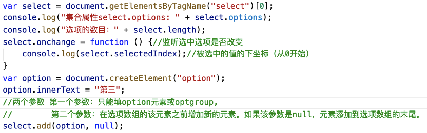
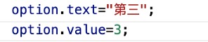

### Select对象和Option对象
#### 下拉列表
#### 一.Select
~~~~
代表HTML表单里的一个下拉列表
属性：
options集合属性，返回包含下拉列表中的所有选项的一个数组。
selectedIndex设置返回下来列表中的被选中的项目的索引位
length选项的数目
方法：
add( )添加选项
事件：
onchange当改变选项时调用的事件
~~~~
­­­­ 

#### 二.Option
~~~~
代表HTML表单里下拉列表中的选项
在HTML中一个<option>标签出现一次，一个Option对象就会被创建
属性：
text某个选项的纯文本值
value输送到服务器的值
 ~~~~
­­­­ 