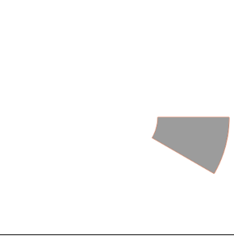
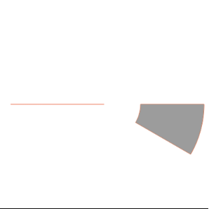
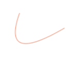
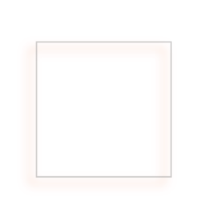

### HTML5-canvas
#### canvas标签 绘画框
~~~~html
<canvas id="canvas" height="400" width="400"></canvas>
~~~~
#### JS部分
~~~~javascript
var canvas = document.getElementById("canvas");获取dom元素
var ctx = canvas.getContext("2d");改成2d画布ctx
~~~~
#### ctx的方法和属性
##### 一.颜色、样式和阴影
~~~~
（一）属性：
1.fillStyle设置或返回用于填充绘画的颜色、渐变或模式
 属性值：（1）color指示绘图填充色的 CSS 颜色值。默认值是 #000000.
         （2）gradient用于填充绘图的渐变对象（线性或放射性）
         （3）pattern 用于填充绘图的 pattern 对象
2.strokeStyle设置或返回用于描边的颜色、渐变或模式
属性值：（1）color指示绘图填充色的 CSS 颜色值。默认值是 #000000.
         （2）gradient用于填充绘图的渐变对象（线性或放射性）
         （3）pattern 用于填充绘图的 pattern 对象
3.shadowColor设置或返回用于阴影的颜色
属性值：（1）color指示绘图填充色的 CSS 颜色值。默认值是 #000000.
4.shadowBlur设置或返回用于阴影的模糊级别
属性值：（1）number阴影的模糊级数
5.shadowOffsetX设置或返回阴影距形状的水平距离
属性值：（1）number正值或负值，定义阴影与形状的水平距离。
6.shadowOffsetY设置或返回阴影距形状的垂直距离
属性值：（1）number正值或负值，定义阴影与形状的垂直距离。
（二）方法：
1. createLinearGradient()创建线性渐变（用在画布内容上）
  参数：（1）x0渐变开始点的 x 坐标
       （2）y0渐变开始点的 y 坐标
（3）x1渐变结束点的 x 坐标
       （4）y1渐变结束点的 y 坐标
2. createPattern()在指定的方向上重复指定的元素
  参数：（1）image规定要使用的图片、画布或视频元素。
       （2）repeat默认。该模式在水平和垂直方向重复
       （3）repeat-x该模式只在水平方向上重复
       （4）repeat-y该模式只在垂直方向上重复
       （5）no-repeat不重复
3. createRadialGradient()创建放射状/环形的渐变（用在画布内容上）
参数：（1）x0	渐变的开始圆的 x 坐标
（2）y0	渐变的开始圆的 y 坐标
（3）r0	开始圆的半径
（4）x1	渐变的结束圆的 x 坐标
（5）y1	渐变的结束圆的 y 坐标
（6）r1	结束圆的半径
4. addColorStop()规定渐变对象中的颜色和停止位置
参数：（1）stop	介于 0.0 与 1.0 之间的值，表示渐变中开始与结束之间的位置。
（2）color	在结束位置显示的 CSS 颜色值
~~~~
##### 二.线条样式
~~~~
（一）属性：
1.lineCap设置或返回线条的结束端点样式
属性值：（1）butt	默认。向线条的每个末端添加平直的边缘。
（2）round	向线条的每个末端添加圆形线帽。（线头圆角）
（3）square	向线条的每个末端添加正方形线帽。
2.lineJoin设置或返回两条线相交时，所创建的拐角类型
属性值：（1）bevel	创建斜角。
（2）round	创建圆角。
（3）miter	默认。创建尖角。
3.lineWidth设置或返回当前的线条宽度
属性值：（1）number	当前线条的宽度，以像素计。
4.miterLimit设置或返回最大斜接长度
属性值：（1）number	正数。规定最大斜接长度。如果斜接长度超过 miterLimit 的值，边角会以 lineJoin 的 "bevel" 类型来显示。
~~~~
##### 三.矩形
~~~~
（一）方法：
1.rect()创建矩形
参数（1）x	矩形左上角的 x 坐标
（2）y	矩形左上角的 y 坐标
（3）width	矩形的宽度，以像素计
（4）height矩形的高度，以像素计
2.fillRect()绘制“被填充”的矩形
参数（1）x	矩形左上角的 x 坐标
（2）y	矩形左上角的 y 坐标
（3）width	矩形的宽度，以像素计
（4）height矩形的高度，以像素计
3.strokeRect()绘制矩形（无填充只描边）
参数（1）x	矩形左上角的 x 坐标
（2）y	矩形左上角的 y 坐标
（3）width	矩形的宽度，以像素计
（4）height矩形的高度，以像素计
4.clearRect()在给定的矩形内清除指定的像素（挖空）
参数（1）x	要清除的矩形左上角的 x 坐标
（2）y	要清除的矩形左上角的 y 坐标
（3）width	要清除的矩形的宽度，以像素计
（4）height要清除的矩形的高度，以像素计
~~~~
##### 四.路径
~~~~
（一）方法：
1.fill()填充当前绘图（默认是黑色）
2.stroke()绘制已定义的路径（描边默认是黑色）
3.beginPath()起始一条路径，或重置当前路径
4.moveTo()把路径移动到画布中的指定点，不创建线条（路径起始点）
参数（1）x	路径的目标位置的 x 坐标
（2）y	路径的目标位置的 y 坐标
5.closePath()	创建从当前点回到起始点的路径
6.lineTo()添加一个新点，然后在画布中创建从该点到最后指定点的线条
参数（1）x	路径的目标位置的 x 坐标
（2）y	路径的目标位置的 y 坐标
7.clip()从原始画布剪切任意形状和尺寸的区域
8.quadraticCurveTo()	创建二次贝塞尔曲线
参数（1）cpx	贝塞尔控制点的 x 坐标
（2）cpy	贝塞尔控制点的 y 坐标
（3）x	结束点的 x 坐标
（4）y	结束点的 y 坐标
9.bezierCurveTo()	创建三次方贝塞尔曲线
参数（1）cp1x	第一个贝塞尔控制点的 x 坐标
（2）cp1y	第一个贝塞尔控制点的 y 坐标
（3）cp2x	第二个贝塞尔控制点的 x 坐标
（4）cp2y	第二个贝塞尔控制点的 y 坐标
（5）x	结束点的 x 坐标
（6）y	结束点的 y 坐标
10.arc()创建弧/曲线（用于创建圆形或部分圆）
参数（1）x	圆的中心的 x 坐标。
（2）y	圆的中心的 y 坐标。
（3）r	圆的半径。
（4）sAngle起始角，以弧度计。（弧的圆形的三点钟位置是 0 度）。
（5）eAngle结束角，以弧度计。
（6）counterclockwise可选。规定应该逆时针还是顺时针绘图。False = 顺时针，true = 逆时针。
11.arcTo()创建两切线之间的弧/曲线
  参数（1）x1弧的起点的 x 坐标
（2）y1弧的起点的 y 坐标
（3）x2弧的终点的 x 坐标
（4）y2弧的终点的 y 坐标
（5）r	弧的半径
12.isPointInPath()	如果指定的点位于当前路径中，则返回 true，否则返回 false
参数（1）x	测试的 x 坐标
（2）y	测试的 y 坐标
~~~~

##### 五.转换
~~~~
（一）方法：
1.scale()	缩放当前绘图至更大或更小
  参数（1）scalewidth	缩放当前绘图的宽度 (1=100%, 0.5=50%, 2=200%, 依次类推)
（2）scaleheight缩放当前绘图的高度 (1=100%, 0.5=50%, 2=200%, etc.)
2.rotate()旋转当前绘图
参数（1）angle	旋转角度，以弧度计。
如需将角度转换为弧度，请使用 degrees*Math.PI/180 公式进行计算。
举例：如需旋转 5 度，可规定下面的公式：5*Math.PI/180。
3.translate()	重新映射画布上的 (0,0) 位置（复制转移）
  参数（1）x	添加到水平坐标（x）上的值
（2）y	添加到垂直坐标（y）上的值
4.transform()	替换绘图的当前转换矩阵
  参数（1）a水平缩放绘图
（2）b水平倾斜绘图
（3）c	垂直倾斜绘图
（4）d垂直缩放绘图
（5）e水平移动绘图
（6）f	垂直移动绘图
5.setTransform()	将当前转换重置为单位矩阵。然后运行 transform()
参数（1）a水平缩放绘图
（2）b水平倾斜绘图
（3）c	垂直倾斜绘图
（4）d垂直缩放绘图
（5）e水平移动绘图
（6）f	垂直移动绘图
~~~~

##### 六.文本
~~~~
（一）属性：
1.font设置或返回文本内容的当前字体属性
2.textAlign设置或返回文本内容的当前对齐方式
  属性值（1）start默认。文本在指定的位置开始。
（2）end文本在指定的位置结束。
（3）center文本的中心被放置在指定的位置。
（4）left	文本左对齐。
（5）right文本右对齐。
3.textBaseline设置或返回在绘制文本时使用的当前文本基线
  属性值（1）alphabetic	默认。文本基线是普通的字母基线。
（2）top	文本基线是 em 方框的顶端。。
（3）hanging文本基线是悬挂基线。
（4）middle	文本基线是 em 方框的正中。
（5）ideographic	文本基线是表意基线。
（6）bottom	文本基线是 em 方框的底端。
 （二）方法：
1.fillText()在画布上绘制“被填充的”文本
  参数（1）text	规定在画布上输出的文本。
（2）x	开始绘制文本的 x 坐标位置（相对于画布）。
（3）y	开始绘制文本的 y 坐标位置（相对于画布）。
（4）maxWidth	可选。允许的最大文本宽度，以像素计。
2.strokeText()在画布上绘制文本（无填充）
参数（1）text	规定在画布上输出的文本。
（2）x	开始绘制文本的 x 坐标位置（相对于画布）。
（3）y	开始绘制文本的 y 坐标位置（相对于画布）。
（4）maxWidth	可选。允许的最大文本宽度，以像素计。
3.measureText()返回包含指定文本宽度的对象
参数（1）text要测量的文本。
~~~~
##### 七.图像绘制（插入图片）
~~~~
（一）方法：
1.drawImage()向画布上绘制图像、画布或视频
  参数（1）img规定要使用的图像、画布或视频。
（2）sx可选。开始剪切的 x 坐标位置。
（3）sy可选。开始剪切的 y 坐标位置。
（4）swidth可选。被剪切图像的宽度。
（5）sheight可选。被剪切图像的高度。
（6）x	在画布上放置图像的 x 坐标位置。
（7）y	在画布上放置图像的 y 坐标位置。
（8）width	可选。要使用的图像的宽度。（伸展或缩小图像）
（9）height可选。要使用的图像的高度。（伸展或缩小图像）
~~~~
##### 八.像素操作
~~~~
（一）属性：
1.width返回 ImageData 对象的宽度
2.height返回 ImageData 对象的高度
3.data返回一个对象，其包含指定的 ImageData 对象的图像数据
（二）方法：
1. createImageData()创建新的、空白的 ImageData 对象
  参数（1）width	   ImageData 对象的宽度，以像素计。
（2）height   ImageData 对象的高度，以像素计。
（3）imageData   另一个 ImageData 对象。
2.getImageData()返回 ImageData 对象，该对象为画布上指定的矩形复制像素数据
  参数（1）x	开始复制的左上角位置的 x 坐标。
（2）y	开始复制的左上角位置的 y 坐标。
（3）width	将要复制的矩形区域的宽度。
（4）height将要复制的矩形区域的高度。
3.putImageData()把图像数据（从指定的 ImageData 对象）放回画布上
  参数（1）imgData	规定要放回画布的 ImageData 对象。
（2）x  	ImageData 对象左上角的 x 坐标，以像素计。
（3）y 	ImageData 对象左上角的 y 坐标，以像素计。
（4）dirtyX	可选。水平值（x），以像素计，在画布上放置图像的位置。
（5）dirtyY	可选。水平值（y），以像素计，在画布上放置图像的位置。
（6）dirtyWidth	可选。在画布上绘制图像所使用的宽度。
（7）dirtyHeight	可选。在画布上绘制图像所使用的高度。
~~~~
##### 九.合成
~~~~
（一）属性：
1.globalAlpha	设置或返回绘图的当前 alpha 或透明值
  属性值（1）number	透明值。必须介于 0.0（完全透明） 与 1.0（不透明） 之间。
2.globalCompositeOperation设置或返回新图像如何绘制到已有的图像上
  属性值（1）source-over	默认。在目标图像上显示源图像。
（2）source-atop	在目标图像顶部显示源图像。源图像位于目标图像之外的部分是  不可见的。
（3）source-in	在目标图像中显示源图像。只有目标图像内的源图像部分会显示，  目标图像是透明的。
（4）source-out	在目标图像之外显示源图像。只会显示目标图像之外源图像部分，   目标图像是透明的。
（5）destination-over	在源图像上方显示目标图像。
（6）destination-atop	在源图像顶部显示目标图像。源图像之外的目标图像部分不  会被显示。
（7）destination-in在源图像中显示目标图像。只有源图像内的目标图像部分会   被显示，源图像是透明的。
（8）destination-out在源图像外显示目标图像。只有源图像外的目标图像部分会  被显示，源图像是透明的。
（9）lighter显示源图像 + 目标图像。
（10）copy显示源图像。忽略目标图像。
（11）xor使用异或操作对源图像与目标图像进行组合
~~~~
##### 十.其他
~~~~
（一）方法：
1.save()保存当前环境的状态
2.restore()返回之前保存过的路径状态和属性
3.createEvent()
4.getContext()
5.toDataURL()
~~~~
##### 画画的流程
~~~~
1.HTML创建画布
<canvas id="canvas" height="400" width="400" style="border: 1px solid;"></canvas>
2.JavaScript设置画布
var canvas = document.getElementById("canvas");
var ctx = canvas.getContext("2d");//创建2d画布
var angle = 2 * Math.PI / 12; //角度
ctx.beginPath();//开始画
（1）.曲线路径
ctx.arc(200, 200, 70, 0, angle * 1, false);//第一笔，画弧度（圆心x，圆心y，半径，起始角度，结束角度，逆时针顺时针）
ctx.arc(200, 200, 192, angle * 1, 0, true);//第二笔
ctx.closePath();//第三笔，回到起始点
ctx.strokeStyle = "#f40";//描边颜色
ctx.stroke();//开始描边
ctx.fillStyle = "#9c9c9c";//填充的颜色
ctx.fill();//开始填充
ctx.save();//保存
 ~~~~
­­­­
~~~~
（2）.画直线
ctx.beginPath();//新的一笔开始
ctx.moveTo(200,200);//起始点
ctx.lineTo (20,200);//结束点
ctx.lineWidth = 1;//线宽
ctx.strokeStyle = "#f40";//描边颜色
ctx.stroke();//开始描边 
ctx.restore();//返回之前保存过的路径状态和属性
~~~~
­­­­
~~~~
（3）.贝塞尔曲线
//画贝二次塞尔曲线
ctx.beginPath();
ctx.moveTo(200,100);//起始点
ctx.quadraticCurveTo(30,200,80,60);
ctx.lineWidth = 1;//线宽
ctx.strokeStyle = "#f40";//描边颜色
ctx.stroke();//开始描边 
ctx.save();//保存
ctx.restore();//返回之前保存过的路径状态和属性
 ~~~~
­­­­
~~~~
（4）阴影和矩形
ctx.beginPath();
ctx.rect(100, 100, 200, 200);//画一个矩形路径
ctx.shadowColor = "#f40";//模糊颜色
ctx.shadowBlur=15;//模糊级别
ctx.shadowOffsetX=10;//模糊的水平方向移动距离
ctx.shadowOffsetY=10;//模糊的垂直方向移动距离
ctx.strokeStyle = "#9c9c9c";//描边颜色
ctx.stroke();//开始描边 
// ctx.strokeRect(100,100,200,200);//画一个描边的矩形
// ctx.fillRect(100,100,200,200);//画一个填充的矩形
 ~~~~
­­­­