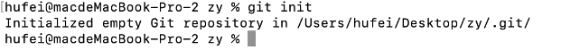
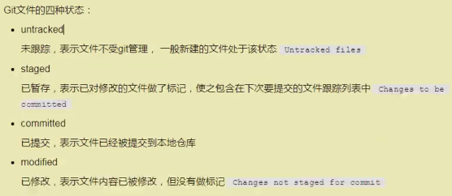
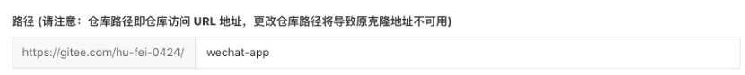

### git（版本库）
#### 一.基本工作流程
~~~~
1.将远程仓库代码克隆到本地仓库
2.将新建文件添加到暂存区（add）
3.将暂存区里的内容提交到本地仓库（commit）
4.将本地仓库内容推送到远程仓库（push）
~~~~
#### 二.git的使用
~~~~
mac自带git（git --version查看git版本）
~~~~
#### 三.初始化仓库（设置使用者的名字和邮箱）
~~~~
git config --global user.name “hufei”
git config --global user.mail “824166449@qq.com”
~~~~

#### 四.查看
~~~~
git config --global user.name
git config --global user.name
~~~~

#### 五.常用git命令
~~~~
（1）git init 初始化本地仓库 会在当前目录创建一个.git目录用于记录所有版本信息
~~~~
 ­­­­
 ~~~~
（2）git status 查看本地仓库的文件状态
~~~~
  ­­­­
  ~~~~
（3）git add文件路径/文件名 将创建的文件放到暂存区里 -A或--all表示添加所有文件，也可以使用*进行匹配/这样就会提示有文件在暂存区，未提交
（4）git commit 将暂存区文件提交至本地仓库 -m指定提交日志
git commit -m “第一次提交”
  需要设置使用名字和邮箱

（5）git log 查看提价的日志
（6）git reset --hard版本id 回退到指定版本 HEAD表示当前版本
版本id可以通过git log查看 就会commit后面一窜数

（7）git refog 查看所有版本，包括回退的版本
~~~~
#### 六.忽略文件
~~~~
根目录下添加了一个.gitignore的文件，用于指定需要被忽略的文件和文件夹
注意
（1）必须是.gitignore
（2）必须在项目的根目录下
（3）每行指定一个忽略文件（只写全文件名）
（4）以#开头表示注释
~~~~

#### 七.远程仓库（gitEe、gitHub、gitLab）
~~~~
（1）与远程仓库连接（origin是给仓库取的别名）
git remote add origin https://gitee.com/hu-fei-0424/wechat-app.git
~~~~
  ­­­­
  ~~~~
（2）查看远程仓库
git remote -v
（3）删除远程仓库
git remote rm 名称（别名）

（4）把本地仓库推代码到远程仓库
git push 别名 分支（git push origin master）
一般为master主分支，默认推送到远程仓库的同名分支，没有则新建

（5）git pull拉起远端代码到本地
git pull origin master

（6）git clone（刚接手公司）下载远程仓库的项目全部代码
git clone https://gitee.com/hu-fei-0424/wechat-app.git
（7）一般是先拉取云端代码，解决文件冲突的问题，再往云端推
~~~~

#### 七.分支（比如开始开发移动端，后来开发pc端）
~~~~
（1）git branch查看分支 默认只有master
（2）git branch 分支名 创建分支
（3）git checkout分支名 切换分支（分支名有*表示当前操作的分支）
~~~~
