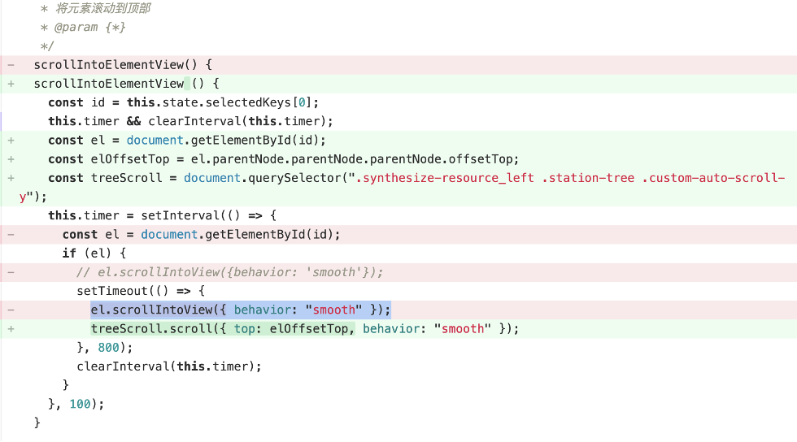

~~~~
window.location.reload刷新页面
process.nexttick()ES6定时器
string.includes(searchvalue, start)查找是否含有子字符串
$(selector).serialize()创建以标准 URL 编码表示的文本字符串(jQuery)
e.stopPropagation()阻止冒泡捕获
e.preventDefault();阻止默认事件
window.screen.availWidth获取屏幕宽度
document.documentElement.clientWidth页面dom宽度
react在新页面跳转用window.open
排序arr.sort((a,b)=>{return a.s-b.s})
用scroll({ top: elOffsetTop, behavior: "smooth" });代替el.scrollIntoView({ behavior: "smooth" });滚动条滚动到可视区域
~~~~
­­­­ 
~~~~
监听esc键盘事件用不用onkeydown，onkeyup，onkeypress，用onresize去监听